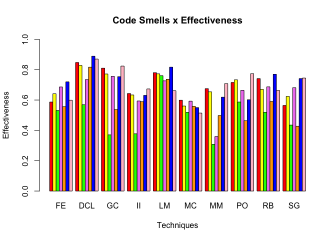

Effectiveness
================
João Correia
11/6/2019

## Effectivenes script

In this notebook, we will explore each step in the script
[Effectiveness.R](https://github.com/correiajoao/data-analysis/blob/master/Effectiveness.R).
The script explores a dataset containing software metrics and
developer’s perception about the presence of code smells in that code
or not.

### Importing pacakges

The first lines in code imports the required for execution.

``` r
library(RWeka)
library(e1071)
library(gmodels)
library(caret)
```

    ## Loading required package: lattice

    ## Loading required package: ggplot2

``` r
library(irr)
```

    ## Loading required package: lpSolve

``` r
library(randomForest)
```

    ## randomForest 4.6-14

    ## Type rfNews() to see new features/changes/bug fixes.

    ## 
    ## Attaching package: 'randomForest'

    ## The following object is masked from 'package:ggplot2':
    ## 
    ##     margin

## Defining functions

### Functions to calculate model’s metrics

Using the results provided by the confusing matrix: true positives, true
negatives, false positives, and false negatives; the following functions
calculate individual metrics from the model’s performance. The metrics
are precision, recall, and f-Measure.

``` r
# Precision
precision <- function(tp, fp){
  precision <- tp/(tp+fp)
  return(precision)
}

# Recall
recall <- function(tp, fn){
  recall <- tp/(tp+fn)
  return(recall)
}

# F-measure
f_measure <- function(tp, fp, fn){
  f_measure <- (2*precision(tp,fp)*recall(tp,fn))/(recall(tp,fn) + precision(tp, fp))
  return(f_measure)
}
```

### Functions to compute confusing matrix

Given the prediction performed by the model and the test set, the
function below computes the confusing matrix and returns in array format
the model’s precision, recall, and f-measure.

``` r
measures <- function(test, pred){
  
  true_positive <- 0
  true_negative <- 0
  false_positive <- 0
  false_negative <- 0
  
  for(i in 1:length(pred)){
    if(test[i] == TRUE && pred[i] == TRUE){
      true_positive <- true_positive + 1
    }else if(test[i] == FALSE && pred[i] == FALSE){
      true_negative <- true_negative + 1
    }else if(test[i] == FALSE && pred[i] == TRUE){
      false_negative <- false_negative + 1
    }else if(test[i] == TRUE && pred[i] == FALSE){
      false_positive <- false_positive + 1
    }
  }
  
  measures <- c(precision(true_positive,false_positive), 
                recall(true_positive,false_negative), 
                f_measure(true_positive,false_positive,false_negative))
  
  return(measures)
}
```

### Functions to perform the machine learning algorithms

The following functions, receive as arguments the dataset and the number
of folders. Each function splits the dataset in train and test. The
function builds a model using the training subset, then predicts the
instances from the test subset. After that, pass the prediction and the
test subset for the function that computes the confusion matrix and the
model’s metrics, returning those metrics.

The algorithms are: - J48 - Naive Bayes - C50 - SVM - One R - JRip -
Random Forest - SMO

``` r
executeJ48 <- function(dataset, folds){
  results <- lapply(folds, function(x) {
    train <- dataset[-x, ]
    test <- dataset[x, ]
    model <- J48(train$Smell~ ., data = train)
    pred <- predict(model, test)
    
    results <- measures(test$Smell, pred)
    
    return(results)
  })
}

executeNaiveBayes <- function(dataset, folds){
  results <- lapply(folds, function(x) {
    train <- dataset[-x, ]
    test <- dataset[x, ]
    model <- naiveBayes(train, train$Smell, laplace = 1)
    pred <- predict(model, test)
    
    results <- measures(test$Smell, pred)
    
    return(results)
  })
  
}

executeC50 <- function(dataset, folds){
  results <- lapply(folds, function(x) {
    train <- dataset[-x, ]
    test <- dataset[x, ]
    model <- C5.0(train, train$Smell)
    pred <- predict(model, test)
    
    results <- measures(test$Smell, pred)
    
    return(results)
  })
  
}

executeSVM <- function(dataset, folds){
  results <- lapply(folds, function(x) {
    train <- dataset[-x, ]
    test <- dataset[x, ]
    model <- svm(train$Smell~ ., data = train)
    pred <- predict(model, test)
    
    results <- measures(test$Smell, pred)
    
    return(results)
  })
  
}

executeOneR <- function(dataset, folds){
  results <- lapply(folds, function(x) {
    train <- dataset[-x, ]
    test <- dataset[x, ]
    model <- OneR(train$Smell~ ., data = train)
    pred <- predict(model, test)
    
    results <- measures(test$Smell, pred)
    
    return(results)
  })
  
}

executeJRip <- function(dataset, folds){
  results <- lapply(folds, function(x) {
    train <- dataset[-x, ]
    test <- dataset[x, ]
    model <- JRip(train$Smell~ ., data = train)
    pred <- predict(model, test)
    
    results <- measures(test$Smell, pred)
    
    return(results)
  })
  
}

executeRandomForest <- function(dataset, folds){
  results <- lapply(folds, function(x) {
    train <- dataset[-x, ]
    test <- dataset[x, ]
    model <- randomForest(train$Smell~ ., data = train)
    pred <- predict(model, test)
    
    results <- measures(test$Smell, pred)
    
    return(results)
  })
}

executeSMO <- function(dataset, folds){
  results <- lapply(folds, function(x) {
    train <- dataset[-x, ]
    test <- dataset[x, ]
    model <- SMO(train$Smell~ ., data = train)
    pred <- predict(model, test)
    
    results <- measures(test$Smell, pred)
    
    return(results)
  })
}
```

## Execution

### Creating data frames

In the execution, the first step is to define arrays and data frames
containing algorithms, developers, and
smells.

``` r
techniques <- c("J48", "NaiveBayes", "SVM", "oneR", "JRip", "RandomForest", "SMO")
smells <- c("FE", "DCL", "GC", "II","LM", "MC", "MM", "PO","RB","SG")

developers <- data.frame(c(1, 5, 6, 9, 55, 58, 60, 84, 97, 99, 101, 103),
                         c(2, 17, 18, 19, 21, 22, 27, 30, 77, 86, 93, 104),
                         c(1, 9, 13, 15, 16, 61, 62, 66, 84, 94, 102, 103),
                         c(2, 7, 21, 22, 24, 25, 28, 86, 104, 110, 111, 124),
                         c(41, 42, 43, 45, 46, 47, 49, 51, 64, 74, 81, 95),
                         c(5, 6, 10, 52, 53, 55, 58, 60, 91, 97, 99, 101),
                         c(8, 11, 39, 40, 41, 42, 43, 45, 46, 47, 74, 81),
                         c(46, 47, 49, 51, 52, 53, 64, 74, 91, 95, 105, 109),
                         c(13, 15, 16, 17, 18, 19, 30, 61, 94, 102, 111, 112),
                         c(5, 49, 51, 52, 53, 55, 56, 64, 91, 95, 99, 105))

colnames(developers) <- smells
list_of_results <- list()
```

### Training models

The code below iterates over each developer and smells, performing the
train, and calculating metrics for each generated model. Each developer
(total 10) has an opinion about one code smell (total 12). For each pair
(developer, smell), all the seven machine learning algorithm is
performed, and the metrics were stored.

``` r
for(j in 1:10){
  
  print(colnames(developers)[j])
  
  path <- paste("/Users/joaocorreia/data-analysis/Developers/",colnames(developers)[j],"/",colnames(developers)[j]," - ",sep="")
  
  results <- data.frame(0,0,0, 0, 0,0,0)
  
  
  for(q in 1:12){
    
    dev_path <- paste(path,developers[q,j],".csv",sep="")  
    dataset <- read.csv(dev_path, stringsAsFactors = FALSE)
    
    dataset$Smell <- factor(dataset$Smell)
    
    set.seed(3)
    folds <- createFolds(dataset$Smell, k =5)
    
    resultsJ48 <- executeJ48(dataset, folds)
    partial_results <- rowMeans(as.data.frame(resultsJ48), na.rm = TRUE)
    
    resultsNaiveBayes <- executeNaiveBayes(dataset, folds)
    partial_results <- rbind(partial_results, rowMeans(as.data.frame(resultsNaiveBayes), na.rm = TRUE) ) 
    
    resultsSVM <- executeSVM(dataset, folds)
    partial_results <- rbind(partial_results, rowMeans(as.data.frame(resultsSVM), na.rm = TRUE)) 
    
    resultsOneR <- executeOneR(dataset, folds)
    partial_results <- rbind(partial_results, rowMeans(as.data.frame(resultsOneR), na.rm = TRUE)) 
    
    resultsJRip <- executeJRip(dataset, folds)
    partial_results <- rbind(partial_results, rowMeans(as.data.frame(resultsJRip), na.rm = TRUE)) 
    
    resultsRandomForest <- executeRandomForest(dataset, folds)
    partial_results <- rbind(partial_results, rowMeans(as.data.frame(resultsRandomForest), na.rm = TRUE)) 
    
    resultsSMO <- executeSMO(dataset, folds)
    partial_results <- rbind(partial_results, rowMeans(as.data.frame(resultsSMO), na.rm = TRUE)) 
    
    rownames(partial_results) <- c("J48", "NaiveBayes", "SVM", "oneR", "JRip", "RandomForest","SMO")
    colnames(partial_results) <- c("Precision", "Recall", "F-measure")
    
    print(paste("Developer",developers[ q, j]))
    
    print(partial_results)
    
    results <- rbind(results, partial_results[,3])
  
  }
  
  results <- results[-1,]
  rownames(results) <- developers[ ,j]
  colnames(results) <- techniques
  results[,] <- lapply(results,function(x){ x[is.nan(x)]<-0;return(x)})
  
  list_of_results[[j]] <- results
  
}
```

    ## [1] "FE"

    ## Warning in svm.default(x, y, scale = scale, ..., na.action = na.action):
    ## Variable(s) 'Essential' constant. Cannot scale data.

    ## [1] "Developer 1"
    ##              Precision    Recall F-measure
    ## J48                0.5 0.5000000 0.6000000
    ## NaiveBayes         0.8 0.7916667 0.8666667
    ## SVM                0.8 0.5416667 0.6916667
    ## oneR               0.8 0.5416667 0.6916667
    ## JRip               0.7 0.4583333 0.5833333
    ## RandomForest       0.4 0.5416667 0.6555556
    ## SMO                0.9 0.7000000 0.7266667

    ## Warning in svm.default(x, y, scale = scale, ..., na.action = na.action):
    ## Variable(s) 'Essential' constant. Cannot scale data.

    ## [1] "Developer 5"
    ##              Precision    Recall F-measure
    ## J48                0.4 0.3333333 0.6666667
    ## NaiveBayes         0.4 0.2500000 0.6666667
    ## SVM                0.2 0.2500000 0.6666667
    ## oneR               0.2 0.1250000 0.6666667
    ## JRip               0.2 0.5000000 1.0000000
    ## RandomForest       0.4 0.6250000 0.6666667
    ## SMO                0.5 0.4583333 0.6888889

    ## Warning in svm.default(x, y, scale = scale, ..., na.action = na.action):
    ## Variable(s) 'Essential' constant. Cannot scale data.

    ## [1] "Developer 6"
    ##              Precision    Recall F-measure
    ## J48          0.6666667 0.8333333 0.6933333
    ## NaiveBayes   0.3666667 0.4166667 0.5666667
    ## SVM          1.0000000 0.7500000 0.8514286
    ## oneR         0.5666667 0.7083333 0.6500000
    ## JRip         0.9000000 0.8166667 0.8247619
    ## RandomForest 0.7666667 0.7666667 0.7200000
    ## SMO          0.8666667 0.8000000 0.7800000

    ## Warning in svm.default(x, y, scale = scale, ..., na.action = na.action):
    ## Variable(s) 'Essential' constant. Cannot scale data.

    ## [1] "Developer 9"
    ##              Precision    Recall F-measure
    ## J48                0.2 0.1250000 0.6666667
    ## NaiveBayes         0.4 0.2500000 0.6666667
    ## SVM                0.2 0.1666667 0.6666667
    ## oneR               0.0 0.0000000       NaN
    ## JRip               0.0 0.0000000       NaN
    ## RandomForest       0.4 0.2666667 0.7500000
    ## SMO                0.7 0.3333333 0.5583333

    ## Warning in svm.default(x, y, scale = scale, ..., na.action = na.action):
    ## Variable(s) 'Essential' constant. Cannot scale data.

    ## [1] "Developer 55"
    ##              Precision    Recall F-measure
    ## J48                0.5 0.4166667 0.6555556
    ## NaiveBayes         0.4 0.4333333 0.6555556
    ## SVM                1.0 0.6000000 0.7466667
    ## oneR               0.8 0.5333333 0.6266667
    ## JRip               1.0 0.6000000 0.7466667
    ## RandomForest       0.3 0.2500000 0.6000000
    ## SMO                0.5 0.3750000 0.6111111

    ## Warning in svm.default(x, y, scale = scale, ..., na.action = na.action):
    ## Variable(s) 'Essential' constant. Cannot scale data.

    ## [1] "Developer 58"
    ##              Precision    Recall F-measure
    ## J48                0.1 0.1666667 0.5000000
    ## NaiveBayes         0.4 0.3750000 0.5555556
    ## SVM                0.9 0.5000000 0.6266667
    ## oneR               0.8 0.5416667 0.7000000
    ## JRip               0.3 0.3333333 0.4500000
    ## RandomForest       0.6 0.5333333 0.6583333
    ## SMO                0.4 0.2916667 0.7333333

    ## Warning in svm.default(x, y, scale = scale, ..., na.action = na.action):
    ## Variable(s) 'Essential' constant. Cannot scale data.

    ## [1] "Developer 60"
    ##              Precision    Recall F-measure
    ## J48                0.3 0.3750000 0.7500000
    ## NaiveBayes         0.1 0.1111111 0.4000000
    ## SVM                0.0 0.0000000       NaN
    ## oneR               0.5 0.5000000 0.6111111
    ## JRip               0.4 0.3750000 0.8333333
    ## RandomForest       0.5 0.6250000 0.8333333
    ## SMO                0.1 0.1666667 0.4000000

    ## Warning in svm.default(x, y, scale = scale, ..., na.action = na.action):
    ## Variable(s) 'Essential' constant. Cannot scale data.

    ## [1] "Developer 84"
    ##              Precision     Recall F-measure
    ## J48                0.0 0.00000000       NaN
    ## NaiveBayes         0.5 0.29166667 0.5000000
    ## SVM                0.0        NaN       NaN
    ## oneR               0.2 0.33333333 1.0000000
    ## JRip               0.0 0.00000000       NaN
    ## RandomForest       0.2 0.12500000 0.6666667
    ## SMO                0.2 0.08333333 0.5000000

    ## Warning in svm.default(x, y, scale = scale, ..., na.action = na.action):
    ## Variable(s) 'Essential' constant. Cannot scale data.

    ## [1] "Developer 97"
    ##              Precision    Recall F-measure
    ## J48                0.8 0.5333333      0.80
    ## NaiveBayes         0.8 0.7333333      0.76
    ## SVM                1.0 0.6666667      0.80
    ## oneR               1.0 0.6666667      0.80
    ## JRip               1.0 0.6666667      0.80
    ## RandomForest       0.8 0.6000000      0.68
    ## SMO                0.9 0.7000000      0.78

    ## Warning in svm.default(x, y, scale = scale, ..., na.action = na.action):
    ## Variable(s) 'Essential' constant. Cannot scale data.

    ## [1] "Developer 99"
    ##              Precision    Recall F-measure
    ## J48                0.0 0.0000000       NaN
    ## NaiveBayes         0.9 0.5333333 0.6333333
    ## SVM                0.0 0.0000000       NaN
    ## oneR               0.3 0.6666667 0.8333333
    ## JRip               0.0 0.0000000       NaN
    ## RandomForest       0.3 0.4000000 0.8333333
    ## SMO                0.4 0.2777778 0.5833333

    ## Warning in svm.default(x, y, scale = scale, ..., na.action = na.action):
    ## Variable(s) 'Essential' constant. Cannot scale data.

    ## [1] "Developer 101"
    ##              Precision    Recall F-measure
    ## J48                0.2 0.2500000 1.0000000
    ## NaiveBayes         0.5 0.5000000 0.6666667
    ## SVM                0.2 0.5000000 0.6666667
    ## oneR               0.4 0.5000000 1.0000000
    ## JRip               0.1 0.5000000 0.6666667
    ## RandomForest       0.3 0.6666667 0.8333333
    ## SMO                0.0 0.0000000       NaN

    ## Warning in svm.default(x, y, scale = scale, ..., na.action = na.action):
    ## Variable(s) 'Essential' constant. Cannot scale data.

    ## [1] "Developer 103"
    ##              Precision    Recall F-measure
    ## J48                0.5 0.7222222 0.7111111
    ## NaiveBayes         0.8 0.8333333 0.7600000
    ## SVM                0.8 0.7000000 0.6600000
    ## oneR               0.5 0.5000000 0.6555556
    ## JRip               0.8 0.6666667 0.7750000
    ## RandomForest       0.7 0.6666667 0.7416667
    ## SMO                1.0 0.7333333 0.8266667
    ## [1] "DCL"

    ## Warning in svm.default(x, y, scale = scale, ..., na.action = na.action):
    ## Variable(s) 'CountDeclClassMethod' constant. Cannot scale data.

    ## Warning in svm.default(x, y, scale = scale, ..., na.action = na.action):
    ## Variable(s) 'CountDeclClassMethod' and 'CountDeclMethodPrivate' constant.
    ## Cannot scale data.

    ## Warning in svm.default(x, y, scale = scale, ..., na.action = na.action):
    ## Variable(s) 'CountDeclClassMethod' constant. Cannot scale data.
    
    ## Warning in svm.default(x, y, scale = scale, ..., na.action = na.action):
    ## Variable(s) 'CountDeclClassMethod' constant. Cannot scale data.

    ## Warning in svm.default(x, y, scale = scale, ..., na.action = na.action):
    ## Variable(s) 'CountClassBase' and 'CountDeclClassMethod' constant. Cannot
    ## scale data.

    ## [1] "Developer 2"
    ##              Precision    Recall F-measure
    ## J48                0.7 0.7333333 0.6600000
    ## NaiveBayes         0.6 0.9166667 0.7833333
    ## SVM                1.0 0.6000000 0.7466667
    ## oneR               0.8 0.9000000 0.8333333
    ## JRip               0.9 0.7333333 0.7600000
    ## RandomForest       0.9 0.9000000 0.8666667
    ## SMO                0.9 0.9333333 0.8933333

    ## Warning in svm.default(x, y, scale = scale, ..., na.action = na.action):
    ## Variable(s) 'CountDeclClassMethod' constant. Cannot scale data.
    
    ## Warning in svm.default(x, y, scale = scale, ..., na.action = na.action):
    ## Variable(s) 'CountClassBase' and 'CountDeclClassMethod' constant. Cannot
    ## scale data.

    ## Warning in svm.default(x, y, scale = scale, ..., na.action = na.action):
    ## Variable(s) 'CountDeclClassMethod' constant. Cannot scale data.
    
    ## Warning in svm.default(x, y, scale = scale, ..., na.action = na.action):
    ## Variable(s) 'CountDeclClassMethod' constant. Cannot scale data.

    ## Warning in svm.default(x, y, scale = scale, ..., na.action =
    ## na.action): Variable(s) 'AvgEssential' and 'CountDeclClassMethod' and
    ## 'CountDeclMethodPrivate' and 'MaxEssential' constant. Cannot scale data.

    ## [1] "Developer 17"
    ##              Precision    Recall F-measure
    ## J48                0.7 0.7916667 0.7833333
    ## NaiveBayes         0.8 0.8333333 0.7600000
    ## SVM                1.0 0.6000000 0.7466667
    ## oneR               0.8 0.7333333 0.7266667
    ## JRip               0.7 0.5666667 0.7333333
    ## RandomForest       0.9 0.8333333 0.8266667
    ## SMO                0.8 0.7000000 0.7000000

    ## Warning in svm.default(x, y, scale = scale, ..., na.action = na.action):
    ## Variable(s) 'CountDeclClassMethod' constant. Cannot scale data.

    ## Warning in svm.default(x, y, scale = scale, ..., na.action = na.action):
    ## Variable(s) 'CountClassBase' and 'CountDeclClassMethod' constant. Cannot
    ## scale data.

    ## Warning in svm.default(x, y, scale = scale, ..., na.action = na.action):
    ## Variable(s) 'CountDeclClassMethod' constant. Cannot scale data.

    ## Warning in svm.default(x, y, scale = scale, ..., na.action = na.action):
    ## Variable(s) 'CountDeclClassMethod' and 'CountDeclMethodPrivate' constant.
    ## Cannot scale data.

    ## Warning in svm.default(x, y, scale = scale, ..., na.action = na.action):
    ## Variable(s) 'CountDeclClassMethod' constant. Cannot scale data.

    ## [1] "Developer 18"
    ##              Precision    Recall F-measure
    ## J48                0.9 1.0000000 0.9333333
    ## NaiveBayes         0.9 0.9333333 0.8933333
    ## SVM                1.0 0.7500000 0.8514286
    ## oneR               0.9 0.8833333 0.8647619
    ## JRip               0.8 0.8166667 0.7580952
    ## RandomForest       1.0 0.8833333 0.9314286
    ## SMO                1.0 0.8166667 0.8914286

    ## Warning in svm.default(x, y, scale = scale, ..., na.action = na.action):
    ## Variable(s) 'CountDeclClassMethod' constant. Cannot scale data.

    ## Warning in svm.default(x, y, scale = scale, ..., na.action = na.action):
    ## Variable(s) 'CountDeclClassMethod' and 'CountDeclMethodPrivate' constant.
    ## Cannot scale data.

    ## Warning in svm.default(x, y, scale = scale, ..., na.action = na.action):
    ## Variable(s) 'CountDeclClassMethod' constant. Cannot scale data.
    
    ## Warning in svm.default(x, y, scale = scale, ..., na.action = na.action):
    ## Variable(s) 'CountDeclClassMethod' constant. Cannot scale data.

    ## Warning in svm.default(x, y, scale = scale, ..., na.action = na.action):
    ## Variable(s) 'CountClassBase' and 'CountDeclClassMethod' constant. Cannot
    ## scale data.

    ## [1] "Developer 19"
    ##              Precision    Recall F-measure
    ## J48                0.8 0.9166667 0.9500000
    ## NaiveBayes         0.9 1.0000000 0.9333333
    ## SVM                0.0       NaN       NaN
    ## oneR               0.6 0.8333333 0.8888889
    ## JRip               0.6 0.6666667 0.9333333
    ## RandomForest       1.0 0.9333333 0.9600000
    ## SMO                1.0 0.8333333 0.8933333

    ## Warning in svm.default(x, y, scale = scale, ..., na.action = na.action):
    ## Variable(s) 'CountDeclClassMethod' constant. Cannot scale data.
    
    ## Warning in svm.default(x, y, scale = scale, ..., na.action = na.action):
    ## Variable(s) 'CountClassBase' and 'CountDeclClassMethod' constant. Cannot
    ## scale data.

    ## Warning in svm.default(x, y, scale = scale, ..., na.action = na.action):
    ## Variable(s) 'CountDeclClassMethod' constant. Cannot scale data.
    
    ## Warning in svm.default(x, y, scale = scale, ..., na.action = na.action):
    ## Variable(s) 'CountDeclClassMethod' constant. Cannot scale data.

    ## Warning in svm.default(x, y, scale = scale, ..., na.action = na.action):
    ## Variable(s) 'CountDeclClassMethod' and 'CountDeclMethodPrivate' constant.
    ## Cannot scale data.

    ## [1] "Developer 21"
    ##              Precision    Recall F-measure
    ## J48                0.9 1.0000000 0.9333333
    ## NaiveBayes         0.7 1.0000000 0.9166667
    ## SVM                1.0 0.6000000 0.7466667
    ## oneR               0.9 0.8666667 0.8533333
    ## JRip               1.0 0.7666667 0.8533333
    ## RandomForest       1.0 1.0000000 1.0000000
    ## SMO                1.0 1.0000000 1.0000000

    ## Warning in svm.default(x, y, scale = scale, ..., na.action = na.action):
    ## Variable(s) 'CountDeclClassMethod' constant. Cannot scale data.

    ## Warning in svm.default(x, y, scale = scale, ..., na.action = na.action):
    ## Variable(s) 'CountClassBase' and 'CountDeclClassMethod' constant. Cannot
    ## scale data.

    ## Warning in svm.default(x, y, scale = scale, ..., na.action = na.action):
    ## Variable(s) 'CountDeclClassMethod' constant. Cannot scale data.
    
    ## Warning in svm.default(x, y, scale = scale, ..., na.action = na.action):
    ## Variable(s) 'CountDeclClassMethod' constant. Cannot scale data.

    ## Warning in svm.default(x, y, scale = scale, ..., na.action = na.action):
    ## Variable(s) 'CountDeclClassMethod' and 'CountDeclMethodPrivate' constant.
    ## Cannot scale data.

    ## [1] "Developer 22"
    ##              Precision    Recall F-measure
    ## J48                0.8 0.8666667 0.7866667
    ## NaiveBayes         0.3 0.5000000 0.6111111
    ## SVM                1.0 0.6000000 0.7466667
    ## oneR               0.8 0.5333333 0.6266667
    ## JRip               0.9 0.8666667 0.8533333
    ## RandomForest       0.7 0.4666667 0.6916667
    ## SMO                0.5 0.5416667 0.7666667

    ## Warning in svm.default(x, y, scale = scale, ..., na.action = na.action):
    ## Variable(s) 'CountDeclClassMethod' constant. Cannot scale data.

    ## Warning in svm.default(x, y, scale = scale, ..., na.action = na.action):
    ## Variable(s) 'CountDeclClassMethod' constant. Cannot scale data.

    ## Warning in svm.default(x, y, scale = scale, ..., na.action =
    ## na.action): Variable(s) 'CountClassBase' and 'CountDeclClassMethod' and
    ## 'CountDeclMethodPrivate' constant. Cannot scale data.

    ## Warning in svm.default(x, y, scale = scale, ..., na.action = na.action):
    ## Variable(s) 'CountDeclClassMethod' constant. Cannot scale data.
    
    ## Warning in svm.default(x, y, scale = scale, ..., na.action = na.action):
    ## Variable(s) 'CountDeclClassMethod' constant. Cannot scale data.

    ## [1] "Developer 27"
    ##              Precision    Recall F-measure
    ## J48                0.6 1.0000000 1.0000000
    ## NaiveBayes         1.0 0.8666667 0.9000000
    ## SVM                0.0       NaN       NaN
    ## oneR               0.0 0.0000000       NaN
    ## JRip               0.6 0.5555556 0.6666667
    ## RandomForest       0.8 0.8333333 0.8750000
    ## SMO                0.8 0.7083333 0.7916667

    ## Warning in svm.default(x, y, scale = scale, ..., na.action = na.action):
    ## Variable(s) 'CountDeclClassMethod' constant. Cannot scale data.
    
    ## Warning in svm.default(x, y, scale = scale, ..., na.action = na.action):
    ## Variable(s) 'CountDeclClassMethod' constant. Cannot scale data.

    ## Warning in svm.default(x, y, scale = scale, ..., na.action = na.action):
    ## Variable(s) 'CountDeclClassMethod' and 'CountDeclMethodPrivate' constant.
    ## Cannot scale data.

    ## Warning in svm.default(x, y, scale = scale, ..., na.action = na.action):
    ## Variable(s) 'CountClassBase' and 'CountDeclClassMethod' constant. Cannot
    ## scale data.

    ## Warning in svm.default(x, y, scale = scale, ..., na.action = na.action):
    ## Variable(s) 'CountDeclClassMethod' constant. Cannot scale data.

    ## [1] "Developer 30"
    ##              Precision    Recall F-measure
    ## J48                0.4 0.3333333 0.6666667
    ## NaiveBayes         1.0 0.8000000 0.8666667
    ## SVM                0.0       NaN       NaN
    ## oneR               0.2 0.2500000 0.6666667
    ## JRip               0.6 0.5000000 0.7777778
    ## RandomForest       1.0 0.8000000 0.8666667
    ## SMO                1.0 0.8000000 0.8666667

    ## Warning in svm.default(x, y, scale = scale, ..., na.action = na.action):
    ## Variable(s) 'CountDeclClassMethod' constant. Cannot scale data.
    
    ## Warning in svm.default(x, y, scale = scale, ..., na.action = na.action):
    ## Variable(s) 'CountDeclClassMethod' constant. Cannot scale data.
    
    ## Warning in svm.default(x, y, scale = scale, ..., na.action = na.action):
    ## Variable(s) 'CountDeclClassMethod' constant. Cannot scale data.
    
    ## Warning in svm.default(x, y, scale = scale, ..., na.action = na.action):
    ## Variable(s) 'CountDeclClassMethod' constant. Cannot scale data.

    ## Warning in svm.default(x, y, scale = scale, ..., na.action =
    ## na.action): Variable(s) 'CountClassBase' and 'CountDeclClassMethod' and
    ## 'CountDeclMethodPrivate' constant. Cannot scale data.

    ## [1] "Developer 77"
    ##              Precision    Recall F-measure
    ## J48          0.9000000 0.8166667 0.8247619
    ## NaiveBayes   0.4666667 0.7500000 0.6416667
    ## SVM          1.0000000 0.8166667 0.8914286
    ## oneR         0.9333333 0.8000000 0.8533333
    ## JRip         1.0000000 0.8166667 0.8914286
    ## RandomForest 0.9000000 0.8166667 0.8247619
    ## SMO          0.8666667 0.8000000 0.8133333

    ## Warning in svm.default(x, y, scale = scale, ..., na.action = na.action):
    ## Variable(s) 'CountDeclClassMethod' constant. Cannot scale data.

    ## Warning in svm.default(x, y, scale = scale, ..., na.action = na.action):
    ## Variable(s) 'CountClassBase' and 'CountDeclClassMethod' constant. Cannot
    ## scale data.

    ## Warning in svm.default(x, y, scale = scale, ..., na.action = na.action):
    ## Variable(s) 'CountDeclClassMethod' constant. Cannot scale data.
    
    ## Warning in svm.default(x, y, scale = scale, ..., na.action = na.action):
    ## Variable(s) 'CountDeclClassMethod' constant. Cannot scale data.

    ## Warning in svm.default(x, y, scale = scale, ..., na.action = na.action):
    ## Variable(s) 'CountDeclClassMethod' and 'CountDeclMethodPrivate' constant.
    ## Cannot scale data.

    ## [1] "Developer 86"
    ##              Precision    Recall F-measure
    ## J48                0.9 1.0000000 0.9333333
    ## NaiveBayes         0.7 1.0000000 0.9166667
    ## SVM                1.0 0.6000000 0.7466667
    ## oneR               0.9 0.8666667 0.8533333
    ## JRip               1.0 0.7666667 0.8533333
    ## RandomForest       1.0 1.0000000 1.0000000
    ## SMO                1.0 1.0000000 1.0000000

    ## Warning in svm.default(x, y, scale = scale, ..., na.action = na.action):
    ## Variable(s) 'CountDeclClassMethod' constant. Cannot scale data.

    ## Warning in svm.default(x, y, scale = scale, ..., na.action = na.action):
    ## Variable(s) 'CountDeclClassMethod' constant. Cannot scale data.
    
    ## Warning in svm.default(x, y, scale = scale, ..., na.action = na.action):
    ## Variable(s) 'CountDeclClassMethod' constant. Cannot scale data.

    ## Warning in svm.default(x, y, scale = scale, ..., na.action = na.action):
    ## Variable(s) 'CountClassBase' and 'CountDeclClassMethod' constant. Cannot
    ## scale data.

    ## Warning in svm.default(x, y, scale = scale, ..., na.action = na.action):
    ## Variable(s) 'CountDeclClassMethod' and 'CountDeclMethodPrivate' constant.
    ## Cannot scale data.

    ## [1] "Developer 93"
    ##              Precision    Recall F-measure
    ## J48                0.8 0.8000000 0.7666667
    ## NaiveBayes         0.8 0.9000000 0.8000000
    ## SVM                0.6 0.4444444 0.6111111
    ## oneR               0.9 0.8000000 0.8000000
    ## JRip               0.9 0.9000000 0.8666667
    ## RandomForest       0.9 0.8333333 0.8266667
    ## SMO                0.9 0.8333333 0.8266667

    ## Warning in svm.default(x, y, scale = scale, ..., na.action = na.action):
    ## Variable(s) 'CountDeclClassMethod' constant. Cannot scale data.

    ## Warning in svm.default(x, y, scale = scale, ..., na.action = na.action):
    ## Variable(s) 'CountClassBase' and 'CountDeclClassMethod' constant. Cannot
    ## scale data.

    ## Warning in svm.default(x, y, scale = scale, ..., na.action = na.action):
    ## Variable(s) 'CountDeclClassMethod' constant. Cannot scale data.
    
    ## Warning in svm.default(x, y, scale = scale, ..., na.action = na.action):
    ## Variable(s) 'CountDeclClassMethod' constant. Cannot scale data.

    ## Warning in svm.default(x, y, scale = scale, ..., na.action = na.action):
    ## Variable(s) 'CountDeclClassMethod' and 'CountDeclMethodPrivate' constant.
    ## Cannot scale data.

    ## [1] "Developer 104"
    ##              Precision    Recall F-measure
    ## J48                0.9 1.0000000 0.9333333
    ## NaiveBayes         0.7 1.0000000 0.9166667
    ## SVM                1.0 0.6000000 0.7466667
    ## oneR               0.9 0.8666667 0.8533333
    ## JRip               1.0 0.7666667 0.8533333
    ## RandomForest       1.0 1.0000000 1.0000000
    ## SMO                1.0 1.0000000 1.0000000
    ## [1] "GC"

    ## Warning in svm.default(x, y, scale = scale, ..., na.action = na.action):
    ## Variable(s) 'CountDeclClassMethod' constant. Cannot scale data.

    ## [1] "Developer 1"
    ##              Precision    Recall F-measure
    ## J48               1.00 0.8750000 0.9166667
    ## NaiveBayes        1.00 0.7000000 0.9166667
    ## SVM               0.25 0.5000000 0.6666667
    ## oneR              0.50 0.6666667 1.0000000
    ## JRip              0.25 0.5000000 1.0000000
    ## RandomForest      0.50 0.6666667 1.0000000
    ## SMO               0.75 0.6250000 0.8888889

    ## Warning in svm.default(x, y, scale = scale, ..., na.action = na.action):
    ## Variable(s) 'CountDeclClassMethod' constant. Cannot scale data.

    ## [1] "Developer 9"
    ##              Precision    Recall F-measure
    ## J48                0.4 0.3333333 0.6666667
    ## NaiveBayes         1.0 0.9000000 0.9333333
    ## SVM                0.6 0.8333333 0.8888889
    ## oneR               1.0 1.0000000 1.0000000
    ## JRip               1.0 1.0000000 1.0000000
    ## RandomForest       1.0 0.9000000 0.9333333
    ## SMO                0.8 0.8750000 0.9166667

    ## Warning in svm.default(x, y, scale = scale, ..., na.action = na.action):
    ## Variable(s) 'CountDeclClassMethod' constant. Cannot scale data.

    ## [1] "Developer 13"
    ##              Precision    Recall F-measure
    ## J48                0.8 0.7500000 0.8333333
    ## NaiveBayes         0.6 0.7777778 0.8333333
    ## SVM                0.0       NaN       NaN
    ## oneR               0.6 0.7777778 0.8333333
    ## JRip               0.4 0.6666667 0.7500000
    ## RandomForest       0.6 0.7777778 0.8333333
    ## SMO                0.2 0.2500000 1.0000000

    ## Warning in svm.default(x, y, scale = scale, ..., na.action = na.action):
    ## Variable(s) 'CountDeclClassMethod' constant. Cannot scale data.

    ## [1] "Developer 15"
    ##              Precision    Recall F-measure
    ## J48                0.4 0.3333333 0.7500000
    ## NaiveBayes         0.2 0.1250000 0.6666667
    ## SVM                0.0       NaN       NaN
    ## oneR               0.0 0.0000000       NaN
    ## JRip               0.0 0.0000000       NaN
    ## RandomForest       0.2 0.5000000 1.0000000
    ## SMO                0.6 0.6000000 1.0000000

    ## Warning in svm.default(x, y, scale = scale, ..., na.action = na.action):
    ## Variable(s) 'CountDeclClassMethod' constant. Cannot scale data.

    ## [1] "Developer 16"
    ##              Precision    Recall F-measure
    ## J48                0.4 0.3333333 0.6666667
    ## NaiveBayes         1.0 0.9000000 0.9333333
    ## SVM                0.6 0.8333333 0.8888889
    ## oneR               1.0 1.0000000 1.0000000
    ## JRip               1.0 1.0000000 1.0000000
    ## RandomForest       1.0 0.9000000 0.9333333
    ## SMO                0.8 0.8750000 0.9166667

    ## Warning in svm.default(x, y, scale = scale, ..., na.action = na.action):
    ## Variable(s) 'CountDeclClassMethod' constant. Cannot scale data.

    ## [1] "Developer 61"
    ##              Precision Recall F-measure
    ## J48               0.25   0.25 1.0000000
    ## NaiveBayes        0.00   0.00       NaN
    ## SVM               0.00    NaN       NaN
    ## oneR              0.50   0.25 0.6666667
    ## JRip              0.00   0.00       NaN
    ## RandomForest      0.00   0.00       NaN
    ## SMO               0.00   0.00       NaN

    ## Warning in svm.default(x, y, scale = scale, ..., na.action = na.action):
    ## Variable(s) 'CountDeclClassMethod' constant. Cannot scale data.

    ## [1] "Developer 62"
    ##              Precision    Recall F-measure
    ## J48                0.6 0.3750000 0.6555556
    ## NaiveBayes         0.5 0.5000000 0.7777778
    ## SVM                0.0       NaN       NaN
    ## oneR               0.3 0.5000000 0.6666667
    ## JRip               0.0       NaN       NaN
    ## RandomForest       0.1 0.3333333 0.6666667
    ## SMO                0.5 0.6111111 0.6666667

    ## Warning in svm.default(x, y, scale = scale, ..., na.action = na.action):
    ## Variable(s) 'CountDeclClassMethod' constant. Cannot scale data.

    ## [1] "Developer 66"
    ##              Precision    Recall F-measure
    ## J48          0.3333333 0.3333333 1.0000000
    ## NaiveBayes   0.6666667 0.5000000 0.8333333
    ## SVM          0.0000000       NaN       NaN
    ## oneR         0.3333333 0.5000000 1.0000000
    ## JRip         0.3333333 0.5000000 1.0000000
    ## RandomForest 0.6666667 0.6666667 1.0000000
    ## SMO          0.6666667 0.5000000 0.8333333

    ## Warning in svm.default(x, y, scale = scale, ..., na.action = na.action):
    ## Variable(s) 'CountDeclClassMethod' constant. Cannot scale data.

    ## [1] "Developer 84"
    ##              Precision    Recall F-measure
    ## J48                0.6 0.5000000 0.7777778
    ## NaiveBayes         0.4 0.5000000 0.8333333
    ## SVM                0.0       NaN       NaN
    ## oneR               0.2 0.1666667 0.6666667
    ## JRip               0.0       NaN       NaN
    ## RandomForest       0.4 0.5000000 0.8333333
    ## SMO                0.4 0.6666667 1.0000000

    ## Warning in svm.default(x, y, scale = scale, ..., na.action = na.action):
    ## Variable(s) 'CountDeclClassMethod' constant. Cannot scale data.

    ## [1] "Developer 94"
    ##              Precision    Recall F-measure
    ## J48                0.8 0.7916667 0.8666667
    ## NaiveBayes         0.8 0.8750000 0.9166667
    ## SVM                0.6 1.0000000 1.0000000
    ## oneR               0.8 0.7916667 0.8666667
    ## JRip               0.8 0.7916667 0.8666667
    ## RandomForest       0.8 0.8750000 0.9166667
    ## SMO                0.8 1.0000000 1.0000000

    ## Warning in svm.default(x, y, scale = scale, ..., na.action = na.action):
    ## Variable(s) 'CountDeclClassMethod' constant. Cannot scale data.

    ## [1] "Developer 102"
    ##              Precision     Recall F-measure
    ## J48                0.6 0.61111111 0.7222222
    ## NaiveBayes         0.4 0.44444444 0.7500000
    ## SVM                0.0        NaN       NaN
    ## oneR               0.2 0.08333333 0.5000000
    ## JRip               0.0        NaN       NaN
    ## RandomForest       0.0 0.00000000       NaN
    ## SMO                0.4 0.66666667 0.7500000

    ## Warning in svm.default(x, y, scale = scale, ..., na.action = na.action):
    ## Variable(s) 'CountDeclClassMethod' constant. Cannot scale data.

    ## [1] "Developer 103"
    ##              Precision    Recall F-measure
    ## J48                0.8 1.0000000 0.8666667
    ## NaiveBayes         0.9 0.9000000 0.8666667
    ## SVM                0.8 1.0000000 1.0000000
    ## oneR               0.7 0.8750000 0.8750000
    ## JRip               0.5 0.8333333 0.8333333
    ## RandomForest       0.9 1.0000000 0.9333333
    ## SMO                0.7 1.0000000 0.9166667
    ## [1] "II"
    ## [1] "Developer 2"
    ##              Precision    Recall F-measure
    ## J48                0.5 0.3333333 0.6555556
    ## NaiveBayes         0.5 0.4666667 0.5416667
    ## SVM                0.8 0.6666667 0.6666667
    ## oneR               0.9 0.6333333 0.7266667
    ## JRip               0.4 0.2777778 0.5833333
    ## RandomForest       0.6 0.4000000 0.5750000
    ## SMO                0.5 0.3000000 0.6000000
    ## [1] "Developer 7"
    ##              Precision    Recall F-measure
    ## J48                0.4 0.3333333 0.6500000
    ## NaiveBayes         0.8 0.6666667 0.7833333
    ## SVM                0.0 0.0000000       NaN
    ## oneR               0.4 0.5833333 0.6111111
    ## JRip               0.2 0.1666667 0.5000000
    ## RandomForest       0.7 0.7000000 0.8333333
    ## SMO                0.7 0.5000000 0.6666667
    ## [1] "Developer 21"
    ##              Precision    Recall F-measure
    ## J48                0.3 0.4166667 0.7333333
    ## NaiveBayes         0.8 0.5666667 0.8166667
    ## SVM                0.9 0.5666667 0.6866667
    ## oneR               0.7 0.5333333 0.7416667
    ## JRip               0.6 0.4583333 0.7555556
    ## RandomForest       0.9 0.7000000 0.7466667
    ## SMO                0.8 0.6666667 0.7200000
    ## [1] "Developer 22"
    ##              Precision Recall F-measure
    ## J48                  0      0       NaN
    ## NaiveBayes           0      0       NaN
    ## SVM                  0    NaN       NaN
    ## oneR                 0      0       NaN
    ## JRip                 0    NaN       NaN
    ## RandomForest         0      0       NaN
    ## SMO                  0      0       NaN
    ## [1] "Developer 24"
    ##              Precision    Recall F-measure
    ## J48                0.6 0.6666667 0.7777778
    ## NaiveBayes         0.6 0.7777778 0.8333333
    ## SVM                0.0 0.0000000       NaN
    ## oneR               0.4 0.5000000 0.6666667
    ## JRip               0.2 1.0000000 1.0000000
    ## RandomForest       0.6 0.8333333 0.8888889
    ## SMO                0.6 0.2666667 0.6111111
    ## [1] "Developer 25"
    ##              Precision    Recall F-measure
    ## J48                0.8 0.5000000 0.6066667
    ## NaiveBayes         0.4 0.6250000 0.6666667
    ## SVM                0.5 0.8333333 0.6250000
    ## oneR               0.7 0.4333333 0.5133333
    ## JRip               0.6 0.4444444 0.6111111
    ## RandomForest       0.8 0.5666667 0.7916667
    ## SMO                0.7 0.6666667 0.6916667
    ## [1] "Developer 28"
    ##              Precision    Recall F-measure
    ## J48                0.7 0.8750000 0.8333333
    ## NaiveBayes         0.9 0.6666667 0.7000000
    ## SVM                0.3 0.6666667 0.5833333
    ## oneR               0.7 0.7500000 0.7500000
    ## JRip               0.4 1.0000000 1.0000000
    ## RandomForest       0.9 0.9000000 0.8666667
    ## SMO                0.9 0.9000000 0.8666667
    ## [1] "Developer 86"
    ##              Precision    Recall F-measure
    ## J48                0.2 0.2500000 0.6666667
    ## NaiveBayes         0.6 0.6666667 0.7777778
    ## SVM                0.0 0.0000000       NaN
    ## oneR               0.4 0.3333333 0.6666667
    ## JRip               0.4 0.5000000 0.6666667
    ## RandomForest       0.6 0.6666667 0.7777778
    ## SMO                0.6 0.8333333 0.8888889
    ## [1] "Developer 104"
    ##              Precision    Recall F-measure
    ## J48               0.25 0.1666667      0.50
    ## NaiveBayes        0.25 0.1666667      0.50
    ## SVM               0.00       NaN       NaN
    ## oneR              0.25 0.1111111      0.50
    ## JRip              0.00       NaN       NaN
    ## RandomForest      0.00 0.0000000       NaN
    ## SMO               0.50 0.4444444      0.75
    ## [1] "Developer 110"
    ##              Precision    Recall F-measure
    ## J48                0.6 0.7083333 0.6666667
    ## NaiveBayes         0.7 0.7000000 0.6333333
    ## SVM                0.8 0.7000000 0.6600000
    ## oneR               0.4 0.4583333 0.5555556
    ## JRip               0.6 0.4444444 0.6111111
    ## RandomForest       0.8 0.6666667 0.6666667
    ## SMO                0.6 0.8750000 0.7500000
    ## [1] "Developer 111"
    ##              Precision    Recall F-measure
    ## J48                0.8 0.8333333 0.7933333
    ## NaiveBayes         0.8 0.7333333 0.6933333
    ## SVM                0.8 0.6000000 0.6733333
    ## oneR               0.6 0.7333333 0.7833333
    ## JRip               0.9 0.6666667 0.7200000
    ## RandomForest       0.7 0.7333333 0.6600000
    ## SMO                0.5 0.7500000 0.6666667
    ## [1] "Developer 124"
    ##              Precision    Recall F-measure
    ## J48                0.4 0.5000000 0.8333333
    ## NaiveBayes         0.4 0.4333333 0.6555556
    ## SVM                0.8 0.6666667 0.6333333
    ## oneR               0.5 0.4583333 0.6111111
    ## JRip               0.7 0.5833333 0.6250000
    ## RandomForest       0.8 0.8333333 0.7600000
    ## SMO                0.9 0.9000000 0.8666667
    ## [1] "LM"
    ## [1] "Developer 41"
    ##              Precision    Recall F-measure
    ## J48                0.8 0.7666667 0.7533333
    ## NaiveBayes         0.8 0.7666667 0.7533333
    ## SVM                1.0 0.6666667 0.8000000
    ## oneR               0.6 0.5833333 0.6500000
    ## JRip               0.9 0.6333333 0.7400000
    ## RandomForest       1.0 0.7333333 0.8400000
    ## SMO                0.9 0.6333333 0.7400000
    ## [1] "Developer 42"
    ##              Precision    Recall F-measure
    ## J48          0.9000000 0.7833333 0.8314286
    ## NaiveBayes   1.0000000 0.8833333 0.9314286
    ## SVM          1.0000000 0.8166667 0.8914286
    ## oneR         0.9000000 0.7833333 0.8314286
    ## JRip         0.6666667 0.7833333 0.6647619
    ## RandomForest 0.9000000 1.0000000 0.9333333
    ## SMO          0.7333333 0.7833333 0.7247619
    ## [1] "Developer 43"
    ##              Precision    Recall F-measure
    ## J48                0.7 0.5000000 0.7000000
    ## NaiveBayes         0.6 0.7916667 0.7416667
    ## SVM                0.6 0.6666667 0.6583333
    ## oneR               0.7 0.5833333 0.6666667
    ## JRip               0.6 0.5833333 0.5833333
    ## RandomForest       0.8 0.8333333 0.7933333
    ## SMO                0.7 0.6666667 0.7416667
    ## [1] "Developer 45"
    ##              Precision    Recall F-measure
    ## J48                0.8 0.7666667 0.7533333
    ## NaiveBayes         0.8 0.9333333 0.8266667
    ## SVM                0.8 0.6000000 0.6800000
    ## oneR               0.9 0.6333333 0.7400000
    ## JRip               1.0 0.6666667 0.8000000
    ## RandomForest       0.9 0.8000000 0.8133333
    ## SMO                0.7 0.6666667 0.6533333
    ## [1] "Developer 46"
    ##              Precision    Recall F-measure
    ## J48                1.0 0.8333333 0.8933333
    ## NaiveBayes         0.8 0.9000000 0.8333333
    ## SVM                0.7 0.6666667 0.7416667
    ## oneR               0.5 0.4444444 0.5555556
    ## JRip               0.9 0.8000000 0.8333333
    ## RandomForest       0.9 0.9000000 0.9000000
    ## SMO                0.6 0.7916667 0.7416667
    ## [1] "Developer 47"
    ##              Precision    Recall F-measure
    ## J48                0.9 0.8166667 0.8247619
    ## NaiveBayes         0.8 0.9333333 0.8266667
    ## SVM                0.9 0.7500000 0.7847619
    ## oneR               0.9 0.7166667 0.7914286
    ## JRip               0.9 0.7166667 0.7914286
    ## RandomForest       0.8 0.7833333 0.7647619
    ## SMO                0.8 0.8166667 0.7580952
    ## [1] "Developer 49"
    ##              Precision    Recall F-measure
    ## J48                0.4 0.4166667 0.9000000
    ## NaiveBayes         0.5 0.7777778 0.7222222
    ## SVM                0.2 0.5000000 1.0000000
    ## oneR               1.0 0.6666667 0.7600000
    ## JRip               0.6 0.6111111 0.7222222
    ## RandomForest       0.6 0.7777778 0.8333333
    ## SMO                0.5 0.5833333 0.7222222
    ## [1] "Developer 51"
    ##              Precision    Recall F-measure
    ## J48                0.6 0.5833333 0.8666667
    ## NaiveBayes         0.3 0.3888889 0.6500000
    ## SVM                0.6 0.6666667 0.6583333
    ## oneR               0.7 0.5666667 0.7333333
    ## JRip               1.0 0.7000000 0.8133333
    ## RandomForest       0.8 0.7333333 0.7266667
    ## SMO                0.3 0.3888889 0.6500000
    ## [1] "Developer 64"
    ##              Precision    Recall F-measure
    ## J48          0.9000000 0.8666667 0.8533333
    ## NaiveBayes   1.0000000 0.8666667 0.9200000
    ## SVM          0.9000000 0.7500000 0.7847619
    ## oneR         0.6333333 0.8333333 0.7666667
    ## JRip         0.9000000 1.0000000 0.9333333
    ## RandomForest 1.0000000 1.0000000 1.0000000
    ## SMO          0.7000000 0.9500000 0.7714286
    ## [1] "Developer 74"
    ##              Precision    Recall F-measure
    ## J48                0.8 0.6666667 0.7200000
    ## NaiveBayes         0.3 0.8333333 0.7333333
    ## SVM                0.9 0.7666667 0.7866667
    ## oneR               0.6 0.3666667 0.7555556
    ## JRip               0.8 0.6333333 0.6600000
    ## RandomForest       0.8 0.7666667 0.7533333
    ## SMO                0.5 0.5555556 0.6555556
    ## [1] "Developer 81"
    ##              Precision    Recall F-measure
    ## J48                0.8 0.6666667 0.6866667
    ## NaiveBayes         0.6 0.7000000 0.7500000
    ## SVM                0.9 0.7333333 0.7600000
    ## oneR               0.9 0.8000000 0.8000000
    ## JRip               1.0 0.6000000 0.7466667
    ## RandomForest       0.7 0.7000000 0.8333333
    ## SMO                0.5 0.6250000 0.7777778
    ## [1] "Developer 95"
    ##              Precision    Recall F-measure
    ## J48                0.3 0.2500000 0.5833333
    ## NaiveBayes         0.3 0.3333333 0.5833333
    ## SVM                0.4 0.2083333 0.5833333
    ## oneR               0.2 0.1250000 0.6666667
    ## JRip               0.5 0.3333333 0.5555556
    ## RandomForest       0.5 0.3750000 0.6111111
    ## SMO                0.0 0.0000000       NaN
    ## [1] "MC"
    ## [1] "Developer 5"
    ##              Precision    Recall F-measure
    ## J48                1.0 0.9000000 0.9333333
    ## NaiveBayes         0.4 0.6666667 0.7500000
    ## SVM                0.4 0.6666667 0.7500000
    ## oneR               0.8 0.7500000 0.8333333
    ## JRip               0.8 0.7500000 0.8333333
    ## RandomForest       0.6 0.6250000 0.8888889
    ## SMO                0.5 0.8333333 0.7777778
    ## [1] "Developer 6"
    ##              Precision    Recall F-measure
    ## J48          0.9000000 0.7833333 0.8314286
    ## NaiveBayes   0.4333333 0.6000000 0.6000000
    ## SVM          1.0000000 0.8166667 0.8914286
    ## oneR         0.9000000 0.8166667 0.8247619
    ## JRip         0.8000000 0.6833333 0.9142857
    ## RandomForest 0.9000000 0.7833333 0.8314286
    ## SMO          1.0000000 0.8166667 0.8914286
    ## [1] "Developer 10"
    ##              Precision Recall F-measure
    ## J48                  0      0       NaN
    ## NaiveBayes           0      0       NaN
    ## SVM                  0    NaN       NaN
    ## oneR                 0      0       NaN
    ## JRip                 0    NaN       NaN
    ## RandomForest         0    NaN       NaN
    ## SMO                  0    NaN       NaN
    ## [1] "Developer 52"
    ##              Precision    Recall F-measure
    ## J48                  1 0.9333333 0.9600000
    ## NaiveBayes           1 0.8166667 0.8914286
    ## SVM                  1 0.7500000 0.8514286
    ## oneR                 1 0.9333333 0.9600000
    ## JRip                 1 0.8666667 0.9200000
    ## RandomForest         1 0.7500000 0.8514286
    ## SMO                  1 0.7500000 0.8514286
    ## [1] "Developer 53"
    ##              Precision Recall F-measure
    ## J48                  0      0       NaN
    ## NaiveBayes           0      0       NaN
    ## SVM                  0    NaN       NaN
    ## oneR                 0      0       NaN
    ## JRip                 0      0       NaN
    ## RandomForest         0    NaN       NaN
    ## SMO                  0    NaN       NaN
    ## [1] "Developer 55"
    ##              Precision    Recall F-measure
    ## J48                0.7 0.4333333 0.6666667
    ## NaiveBayes         0.3 0.5000000 0.5833333
    ## SVM                0.9 0.5666667 0.6866667
    ## oneR               0.3 0.4166667 0.7333333
    ## JRip               1.0 0.6000000 0.7466667
    ## RandomForest       0.2 0.2083333 0.4500000
    ## SMO                0.8 0.4666667 0.7333333
    ## [1] "Developer 58"
    ##              Precision Recall F-measure
    ## J48          0.3333333  0.250 0.6666667
    ## NaiveBayes   0.3333333  0.125 0.6666667
    ## SVM          0.0000000    NaN       NaN
    ## oneR         0.0000000  0.000       NaN
    ## JRip         0.0000000  0.000       NaN
    ## RandomForest 0.0000000    NaN       NaN
    ## SMO          0.0000000    NaN       NaN
    ## [1] "Developer 60"
    ##              Precision    Recall F-measure
    ## J48                0.3 0.2083333 0.5333333
    ## NaiveBayes         0.1 0.5000000 0.6666667
    ## SVM                0.5 0.5000000 0.6666667
    ## oneR               0.2 0.1250000 0.6666667
    ## JRip               0.4 0.3333333 0.6666667
    ## RandomForest       0.3 0.2000000 0.5833333
    ## SMO                0.3 0.3750000 0.6666667
    ## [1] "Developer 91"
    ##              Precision    Recall F-measure
    ## J48                0.2 0.1666667 0.5000000
    ## NaiveBayes         0.6 0.2000000 0.5000000
    ## SVM                0.0       NaN       NaN
    ## oneR               0.2 1.0000000 1.0000000
    ## JRip               0.2 0.1666667 0.5000000
    ## RandomForest       0.6 0.7777778 0.8333333
    ## SMO                0.0 0.0000000       NaN
    ## [1] "Developer 97"
    ##              Precision    Recall F-measure
    ## J48                0.6 0.5416667 0.6166667
    ## NaiveBayes         0.4 0.6666667 0.6111111
    ## SVM                1.0 0.6000000 0.7466667
    ## oneR               0.7 0.5833333 0.6916667
    ## JRip               0.7 0.4333333 0.6583333
    ## RandomForest       0.4 0.5416667 0.6555556
    ## SMO                0.6 0.4333333 0.6166667
    ## [1] "Developer 99"
    ##              Precision    Recall F-measure
    ## J48                0.9 0.7666667 0.7666667
    ## NaiveBayes         0.5 0.6250000 0.8333333
    ## SVM                0.5 0.8333333 0.8333333
    ## oneR               0.3 0.5000000 0.7500000
    ## JRip               0.3 0.7500000 0.6666667
    ## RandomForest       0.3 0.5000000 0.7500000
    ## SMO                0.5 0.8333333 0.8333333
    ## [1] "Developer 101"
    ##              Precision    Recall F-measure
    ## J48                0.8 0.7000000 0.7133333
    ## NaiveBayes         0.4 0.8750000 0.6250000
    ## SVM                1.0 0.6666667 0.8000000
    ## oneR               0.7 0.6666667 0.6533333
    ## JRip               1.0 0.6666667 0.8000000
    ## RandomForest       0.8 0.7333333 0.7600000
    ## SMO                1.0 0.6666667 0.8000000
    ## [1] "MM"

    ## Warning in svm.default(x, y, scale = scale, ..., na.action = na.action):
    ## Variable(s) 'CountClassDerived' constant. Cannot scale data.

    ## Warning in svm.default(x, y, scale = scale, ..., na.action = na.action):
    ## Variable(s) 'CountDeclClassMethod' constant. Cannot scale data.

    ## [1] "Developer 8"
    ##              Precision    Recall F-measure
    ## J48               0.50 0.5000000 0.8333333
    ## NaiveBayes        0.50 0.2500000 0.6666667
    ## SVM               0.25 1.0000000 1.0000000
    ## oneR              0.50 0.5000000 0.8333333
    ## JRip              0.00 0.0000000       NaN
    ## RandomForest      0.50 0.6666667 1.0000000
    ## SMO               0.50 0.5000000 0.6666667

    ## Warning in svm.default(x, y, scale = scale, ..., na.action = na.action):
    ## Variable(s) 'CountDeclClassMethod' constant. Cannot scale data.

    ## [1] "Developer 11"
    ##              Precision    Recall F-measure
    ## J48                0.2 0.1666667 0.6666667
    ## NaiveBayes         0.1 0.1666667 0.5000000
    ## SVM                0.0       NaN       NaN
    ## oneR               0.3 0.3333333 0.5833333
    ## JRip               0.0 0.0000000       NaN
    ## RandomForest       0.0 0.0000000       NaN
    ## SMO                0.2 0.1666667 0.6666667

    ## Warning in svm.default(x, y, scale = scale, ..., na.action = na.action):
    ## Variable(s) 'CountDeclMethodProtected' constant. Cannot scale data.
    
    ## Warning in svm.default(x, y, scale = scale, ..., na.action = na.action):
    ## Variable(s) 'CountDeclClassMethod' constant. Cannot scale data.

    ## Warning in svm.default(x, y, scale = scale, ..., na.action = na.action):
    ## Variable(s) 'CountDeclMethodDefault' constant. Cannot scale data.

    ## [1] "Developer 39"
    ##              Precision    Recall F-measure
    ## J48               0.75 0.5833333 0.8333333
    ## NaiveBayes        0.75 0.4000000 0.7777778
    ## SVM               0.25 1.0000000 1.0000000
    ## oneR              0.00 0.0000000       NaN
    ## JRip              0.50 0.6666667 1.0000000
    ## RandomForest      0.50 0.6666667 1.0000000
    ## SMO               0.50 0.7500000 0.8333333

    ## Warning in svm.default(x, y, scale = scale, ..., na.action = na.action):
    ## Variable(s) 'CountDeclClassMethod' constant. Cannot scale data.

    ## [1] "Developer 40"
    ##              Precision    Recall F-measure
    ## J48                0.6 0.7916667 0.7000000
    ## NaiveBayes         0.8 0.9166667 0.9500000
    ## SVM                1.0 0.8000000 0.8600000
    ## oneR               0.8 0.7083333 0.8166667
    ## JRip               0.6 0.4166667 0.7000000
    ## RandomForest       0.8 0.7916667 0.8666667
    ## SMO                1.0 0.8000000 0.8600000

    ## Warning in svm.default(x, y, scale = scale, ..., na.action = na.action):
    ## Variable(s) 'CountDeclClassMethod' constant. Cannot scale data.

    ## [1] "Developer 41"
    ##              Precision    Recall F-measure
    ## J48                0.4 0.5000000 0.8333333
    ## NaiveBayes         1.0 0.6000000 0.7266667
    ## SVM                0.0 0.0000000       NaN
    ## oneR               0.4 0.5000000 0.6666667
    ## JRip               0.2 0.1666667 0.5000000
    ## RandomForest       0.9 0.6666667 0.7000000
    ## SMO                0.7 0.4583333 0.5833333

    ## Warning in svm.default(x, y, scale = scale, ..., na.action = na.action):
    ## Variable(s) 'CountClassDerived' constant. Cannot scale data.

    ## Warning in svm.default(x, y, scale = scale, ..., na.action = na.action):
    ## Variable(s) 'CountDeclClassMethod' constant. Cannot scale data.

    ## [1] "Developer 42"
    ##              Precision    Recall F-measure
    ## J48                0.4 0.5000000 0.8333333
    ## NaiveBayes         0.8 0.5000000 0.7500000
    ## SVM                0.4 0.7500000 0.8333333
    ## oneR               0.0 0.0000000       NaN
    ## JRip               0.2 0.5000000 0.6666667
    ## RandomForest       0.4 0.7500000 0.8333333
    ## SMO                0.6 0.4583333 0.7222222

    ## Warning in svm.default(x, y, scale = scale, ..., na.action = na.action):
    ## Variable(s) 'CountDeclClassMethod' constant. Cannot scale data.

    ## [1] "Developer 43"
    ##              Precision Recall F-measure
    ## J48                  0      0       NaN
    ## NaiveBayes           0      0       NaN
    ## SVM                  0    NaN       NaN
    ## oneR                 0      0       NaN
    ## JRip                 0    NaN       NaN
    ## RandomForest         0    NaN       NaN
    ## SMO                  0      0       NaN

    ## Warning in svm.default(x, y, scale = scale, ..., na.action = na.action):
    ## Variable(s) 'CountDeclClassMethod' constant. Cannot scale data.

    ## [1] "Developer 45"
    ##              Precision    Recall F-measure
    ## J48                0.6 0.5000000 0.7777778
    ## NaiveBayes         0.8 0.6250000 0.7500000
    ## SVM                0.0       NaN       NaN
    ## oneR               0.0 0.0000000       NaN
    ## JRip               0.2 0.2500000 0.6666667
    ## RandomForest       0.8 0.6250000 0.7500000
    ## SMO                0.4 0.3333333 0.6666667

    ## Warning in svm.default(x, y, scale = scale, ..., na.action = na.action):
    ## Variable(s) 'CountDeclClassMethod' constant. Cannot scale data.

    ## [1] "Developer 46"
    ##              Precision    Recall F-measure
    ## J48                0.1 0.1666667 0.5000000
    ## NaiveBayes         0.6 0.6666667 0.7777778
    ## SVM                0.0 0.0000000       NaN
    ## oneR               0.1 0.2500000 0.5000000
    ## JRip               0.5 0.5000000 0.6111111
    ## RandomForest       0.0 0.0000000       NaN
    ## SMO                0.3 0.3750000 0.7500000

    ## Warning in svm.default(x, y, scale = scale, ..., na.action = na.action):
    ## Variable(s) 'CountDeclClassMethod' constant. Cannot scale data.

    ## [1] "Developer 47"
    ##              Precision    Recall F-measure
    ## J48                0.3 0.5000000 0.6666667
    ## NaiveBayes         0.8 0.5333333 0.7833333
    ## SVM                0.0 0.0000000       NaN
    ## oneR               0.0 0.0000000       NaN
    ## JRip               0.2 0.2500000 0.6666667
    ## RandomForest       0.5 0.3666667 0.6111111
    ## SMO                0.3 0.3000000 0.7500000

    ## Warning in svm.default(x, y, scale = scale, ..., na.action = na.action):
    ## Variable(s) 'CountDeclClassMethod' constant. Cannot scale data.

    ## [1] "Developer 74"
    ##              Precision    Recall F-measure
    ## J48                0.2 0.1250000 0.6666667
    ## NaiveBayes         0.8 0.4333333 0.6666667
    ## SVM                0.0 0.0000000       NaN
    ## oneR               0.0 0.0000000       NaN
    ## JRip               0.2 0.1666667 0.6666667
    ## RandomForest       0.2 0.3333333 1.0000000
    ## SMO                0.2 0.2000000 1.0000000

    ## Warning in svm.default(x, y, scale = scale, ..., na.action = na.action):
    ## Variable(s) 'CountDeclClassMethod' constant. Cannot scale data.

    ## [1] "Developer 81"
    ##              Precision    Recall F-measure
    ## J48                0.8 0.7083333 0.7916667
    ## NaiveBayes         0.6 0.3333333 0.5000000
    ## SVM                0.0 0.0000000       NaN
    ## oneR               0.8 0.8750000 0.9166667
    ## JRip               0.2 0.3333333 0.5000000
    ## RandomForest       0.2 0.5000000 0.6666667
    ## SMO                0.2 0.3333333 1.0000000
    ## [1] "PO"
    ## [1] "Developer 46"
    ##              Precision    Recall F-measure
    ## J48          0.7666667 1.0000000 0.8333333
    ## NaiveBayes   0.8666667 0.9333333 0.8800000
    ## SVM          1.0000000 0.8166667 0.8914286
    ## oneR         0.8666667 0.9333333 0.8600000
    ## JRip         0.8666667 0.8666667 0.8200000
    ## RandomForest 0.9333333 0.8666667 0.8933333
    ## SMO          0.9333333 0.8666667 0.8933333
    ## [1] "Developer 47"
    ##              Precision    Recall F-measure
    ## J48                0.6 0.7333333 0.6266667
    ## NaiveBayes         0.5 0.7333333 0.7000000
    ## SVM                0.9 0.6333333 0.7400000
    ## oneR               0.7 0.6333333 0.6600000
    ## JRip               0.9 0.6333333 0.7400000
    ## RandomForest       0.8 0.5333333 0.8000000
    ## SMO                0.7 0.5000000 0.7250000
    ## [1] "Developer 49"
    ##              Precision    Recall F-measure
    ## J48                0.6 0.5000000 0.7777778
    ## NaiveBayes         0.8 0.7500000 0.8333333
    ## SVM                0.4 1.0000000 1.0000000
    ## oneR               0.8 0.7083333 0.7916667
    ## JRip               0.2 0.5000000 0.6666667
    ## RandomForest       0.6 0.6250000 0.8888889
    ## SMO                0.8 0.4666667 0.7083333
    ## [1] "Developer 51"
    ##              Precision    Recall F-measure
    ## J48                0.6 0.5555556 0.7111111
    ## NaiveBayes         0.6 0.6666667 0.7000000
    ## SVM                0.4 0.1666667 0.5833333
    ## oneR               0.7 0.7083333 0.7333333
    ## JRip               0.8 0.5416667 0.7000000
    ## RandomForest       0.5 0.4000000 0.7222222
    ## SMO                0.6 0.5416667 0.6000000
    ## [1] "Developer 52"
    ##              Precision    Recall F-measure
    ## J48                0.6 0.8888889 0.9333333
    ## NaiveBayes         0.8 0.9166667 0.9500000
    ## SVM                0.8 0.6333333 0.8666667
    ## oneR               0.7 0.8750000 0.8750000
    ## JRip               0.5 0.6666667 0.7333333
    ## RandomForest       0.8 0.6333333 0.8666667
    ## SMO                0.6 0.6666667 0.9333333
    ## [1] "Developer 53"
    ##              Precision    Recall F-measure
    ## J48               0.25 0.3333333 1.0000000
    ## NaiveBayes        0.25 0.3333333 1.0000000
    ## SVM               0.00       NaN       NaN
    ## oneR              0.50 0.5000000 0.8333333
    ## JRip              0.00 0.0000000       NaN
    ## RandomForest      0.00 0.0000000       NaN
    ## SMO               0.75 0.6111111 0.7222222
    ## [1] "Developer 64"
    ##              Precision    Recall F-measure
    ## J48                0.4 0.5555556 0.6000000
    ## NaiveBayes         0.2 0.5000000 0.5833333
    ## SVM                0.5 0.6250000 0.7777778
    ## oneR               0.0 0.0000000       NaN
    ## JRip               0.1 0.5000000 0.5000000
    ## RandomForest       0.2 0.5000000 0.5833333
    ## SMO                0.1 0.1250000 0.5000000
    ## [1] "Developer 74"
    ##              Precision    Recall F-measure
    ## J48                0.7 0.7083333 0.7750000
    ## NaiveBayes         0.7 0.7083333 0.7750000
    ## SVM                0.9 0.6333333 0.7400000
    ## oneR               0.9 0.7333333 0.7733333
    ## JRip               0.9 0.6333333 0.7400000
    ## RandomForest       0.8 0.7500000 0.8500000
    ## SMO                0.8 0.7000000 0.7133333
    ## [1] "Developer 91"
    ##              Precision    Recall F-measure
    ## J48                0.2 0.2000000 0.5000000
    ## NaiveBayes         0.5 0.4333333 0.7111111
    ## SVM                0.5 0.6250000 0.7777778
    ## oneR               0.4 0.5000000 0.6666667
    ## JRip               0.0 0.0000000       NaN
    ## RandomForest       0.7 0.6333333 0.7833333
    ## SMO                0.6 0.6000000 0.7083333
    ## [1] "Developer 95"
    ##              Precision    Recall F-measure
    ## J48                0.4 0.3750000 0.8333333
    ## NaiveBayes         0.5 0.6666667 0.6666667
    ## SVM                0.2 0.5000000 0.6666667
    ## oneR               0.6 0.6250000 0.8888889
    ## JRip               0.2 0.2500000 0.6666667
    ## RandomForest       0.8 0.7500000 0.8333333
    ## SMO                0.2 0.3333333 1.0000000
    ## [1] "Developer 105"
    ##              Precision    Recall F-measure
    ## J48               0.50 0.5000000 1.0000000
    ## NaiveBayes        0.25 0.2500000 1.0000000
    ## SVM               0.00       NaN       NaN
    ## oneR              0.75 0.8333333 0.8888889
    ## JRip              0.00 0.0000000       NaN
    ## RandomForest      0.00 0.0000000       NaN
    ## SMO               0.75 0.5000000 0.7777778
    ## [1] "Developer 109"
    ##              Precision Recall F-measure
    ## J48                0.0      0       NaN
    ## NaiveBayes         0.0    NaN       NaN
    ## SVM                0.0    NaN       NaN
    ## oneR               0.0      0       NaN
    ## JRip               0.0      0       NaN
    ## RandomForest       0.0    NaN       NaN
    ## SMO                0.5      1         1
    ## [1] "RB"

    ## Warning in svm.default(x, y, scale = scale, ..., na.action = na.action):
    ## Variable(s) 'BCountDeclClassMethod' and 'BCountDeclMethodPrivate' constant.
    ## Cannot scale data.

    ## [1] "Developer 13"
    ##              Precision    Recall F-measure
    ## J48                0.4 0.2083333 0.5833333
    ## NaiveBayes         0.2 0.3333333 1.0000000
    ## SVM                0.0       NaN       NaN
    ## oneR               0.0 0.0000000       NaN
    ## JRip               0.0       NaN       NaN
    ## RandomForest       0.2 0.1666667 0.6666667
    ## SMO                0.2 0.1111111 0.5000000

    ## Warning in svm.default(x, y, scale = scale, ..., na.action = na.action):
    ## Variable(s) 'BCountDeclMethodPrivate' constant. Cannot scale data.

    ## [1] "Developer 15"
    ##              Precision    Recall F-measure
    ## J48                0.8 0.5666667 0.8166667
    ## NaiveBayes         0.8 0.5000000 0.5933333
    ## SVM                0.7 0.4583333 0.5833333
    ## oneR               0.6 0.2666667 0.6111111
    ## JRip               0.6 0.3750000 0.6555556
    ## RandomForest       0.6 0.6250000 0.6166667
    ## SMO                0.4 0.4666667 0.6111111

    ## Warning in svm.default(x, y, scale = scale, ..., na.action = na.action):
    ## Variable(s) 'BCountDeclMethodPrivate' constant. Cannot scale data.

    ## [1] "Developer 16"
    ##              Precision    Recall F-measure
    ## J48                0.6 0.6000000 0.5666667
    ## NaiveBayes         0.3 0.4444444 0.4666667
    ## SVM                0.9 0.5666667 0.6866667
    ## oneR               0.7 0.6000000 0.6000000
    ## JRip               1.0 0.6000000 0.7466667
    ## RandomForest       0.6 0.5000000 0.5833333
    ## SMO                0.5 0.4583333 0.5166667

    ## Warning in svm.default(x, y, scale = scale, ..., na.action = na.action):
    ## Variable(s) 'BCountDeclMethodPrivate' constant. Cannot scale data.

    ## [1] "Developer 17"
    ##              Precision    Recall F-measure
    ## J48          1.0000000 0.6666667 0.7777778
    ## NaiveBayes   0.0000000       NaN       NaN
    ## SVM          0.0000000       NaN       NaN
    ## oneR         0.6666667 0.7500000 0.8333333
    ## JRip         0.3333333 0.5000000 0.6666667
    ## RandomForest 0.6666667 1.0000000 1.0000000
    ## SMO          0.3333333 0.2500000 0.6666667

    ## Warning in svm.default(x, y, scale = scale, ..., na.action = na.action):
    ## Variable(s) 'BCountDeclMethodPrivate' constant. Cannot scale data.

    ## [1] "Developer 18"
    ##              Precision    Recall F-measure
    ## J48                0.8 0.8750000 0.9166667
    ## NaiveBayes         0.7 0.8333333 0.8500000
    ## SVM                1.0 0.8333333 0.8933333
    ## oneR               0.8 0.8750000 0.9166667
    ## JRip               0.8 0.8000000 0.7666667
    ## RandomForest       0.8 0.8750000 0.9166667
    ## SMO                0.8 0.9166667 0.9500000

    ## Warning in svm.default(x, y, scale = scale, ..., na.action = na.action):
    ## Variable(s) 'BCountDeclMethodPrivate' constant. Cannot scale data.

    ## [1] "Developer 19"
    ##              Precision    Recall F-measure
    ## J48                0.9 0.8666667 0.8533333
    ## NaiveBayes         1.0 0.6666667 0.7866667
    ## SVM                0.9 0.7333333 0.7600000
    ## oneR               1.0 0.8666667 0.9200000
    ## JRip               0.8 0.7000000 0.7066667
    ## RandomForest       0.8 0.8333333 0.7933333
    ## SMO                0.7 0.6666667 0.7416667

    ## Warning in svm.default(x, y, scale = scale, ..., na.action = na.action):
    ## Variable(s) 'BCountDeclMethodPrivate' constant. Cannot scale data.

    ## [1] "Developer 30"
    ##              Precision    Recall F-measure
    ## J48                0.7 0.7500000 0.7916667
    ## NaiveBayes         0.7 0.7500000 0.7500000
    ## SVM                0.9 0.5000000 0.6266667
    ## oneR               0.9 0.8333333 0.8266667
    ## JRip               0.7 0.6250000 0.6666667
    ## RandomForest       0.7 0.7916667 0.7833333
    ## SMO                1.0 0.7333333 0.8266667

    ## Warning in svm.default(x, y, scale = scale, ..., na.action = na.action):
    ## Variable(s) 'BCountDeclMethodPrivate' constant. Cannot scale data.

    ## [1] "Developer 61"
    ##              Precision    Recall F-measure
    ## J48                0.3 0.2500000 0.5833333
    ## NaiveBayes         0.2 0.1250000 0.6666667
    ## SVM                0.2 0.5000000 0.6666667
    ## oneR               0.2 0.1250000 0.6666667
    ## JRip               0.0 0.0000000       NaN
    ## RandomForest       0.2 0.1666667 0.6666667
    ## SMO                0.2 0.1666667 0.6666667

    ## Warning in svm.default(x, y, scale = scale, ..., na.action = na.action):
    ## Variable(s) 'BCountDeclMethodPrivate' constant. Cannot scale data.

    ## [1] "Developer 94"
    ##              Precision    Recall F-measure
    ## J48                0.7 0.7083333 0.7083333
    ## NaiveBayes         0.4 0.2916667 0.7333333
    ## SVM                0.8 0.5000000 0.6583333
    ## oneR               0.8 0.6000000 0.6266667
    ## JRip               0.6 0.4444444 0.6111111
    ## RandomForest       0.6 0.7083333 0.6250000
    ## SMO                0.9 0.9333333 0.8933333

    ## Warning in svm.default(x, y, scale = scale, ..., na.action = na.action):
    ## Variable(s) 'BCountDeclMethodPrivate' constant. Cannot scale data.

    ## [1] "Developer 102"
    ##              Precision    Recall F-measure
    ## J48                0.6 0.4666667 0.6416667
    ## NaiveBayes         0.8 0.7666667 0.7333333
    ## SVM                0.3 0.4166667 0.5000000
    ## oneR               0.7 0.7000000 0.8750000
    ## JRip               0.3 0.5000000 0.7500000
    ## RandomForest       0.8 0.7666667 0.7333333
    ## SMO                0.9 0.7000000 0.7266667

    ## Warning in svm.default(x, y, scale = scale, ..., na.action = na.action):
    ## Variable(s) 'BCountDeclMethodPrivate' constant. Cannot scale data.

    ## [1] "Developer 111"
    ##              Precision    Recall F-measure
    ## J48          0.8333333 0.8666667 0.8266667
    ## NaiveBayes   0.6666667 0.6333333 0.8000000
    ## SVM          1.0000000 0.7500000 0.8514286
    ## oneR         0.7000000 0.7333333 0.8666667
    ## JRip         0.8000000 0.6000000 0.8500000
    ## RandomForest 0.9333333 0.8000000 0.8533333
    ## SMO          0.8666667 0.9333333 0.8600000

    ## Warning in svm.default(x, y, scale = scale, ..., na.action = na.action):
    ## Variable(s) 'BCountDeclMethodPrivate' constant. Cannot scale data.

    ## [1] "Developer 112"
    ##              Precision    Recall F-measure
    ## J48               0.50 0.5000000 0.8333333
    ## NaiveBayes        0.25 0.1666667 0.6666667
    ## SVM               0.00       NaN       NaN
    ## oneR              0.25 0.1666667 0.5000000
    ## JRip              0.25 0.5000000 0.6666667
    ## RandomForest      0.25 0.5000000 1.0000000
    ## SMO               0.00 0.0000000       NaN
    ## [1] "SG"

    ## Warning in svm.default(x, y, scale = scale, ..., na.action = na.action):
    ## Variable(s) 'CountDeclMethodDefault' constant. Cannot scale data.

    ## Warning in svm.default(x, y, scale = scale, ..., na.action = na.action):
    ## Variable(s) 'CountDeclMethodDefault' constant. Cannot scale data.

    ## Warning in svm.default(x, y, scale = scale, ..., na.action = na.action):
    ## Variable(s) 'CountDeclClassMethod' and 'CountDeclMethodDefault' constant.
    ## Cannot scale data.

    ## Warning in svm.default(x, y, scale = scale, ..., na.action = na.action):
    ## Variable(s) 'CountDeclMethodDefault' constant. Cannot scale data.
    
    ## Warning in svm.default(x, y, scale = scale, ..., na.action = na.action):
    ## Variable(s) 'CountDeclMethodDefault' constant. Cannot scale data.

    ## [1] "Developer 5"
    ##              Precision    Recall F-measure
    ## J48                0.4 0.1666667 0.5833333
    ## NaiveBayes         0.6 0.4583333 0.7222222
    ## SVM                0.4 1.0000000 1.0000000
    ## oneR               0.2 0.1666667 0.5000000
    ## JRip               0.2 0.3333333 0.5000000
    ## RandomForest       0.4 0.2777778 0.5833333
    ## SMO                0.4 0.3333333 0.7500000

    ## Warning in svm.default(x, y, scale = scale, ..., na.action = na.action):
    ## Variable(s) 'CountDeclMethodDefault' constant. Cannot scale data.
    
    ## Warning in svm.default(x, y, scale = scale, ..., na.action = na.action):
    ## Variable(s) 'CountDeclMethodDefault' constant. Cannot scale data.

    ## Warning in svm.default(x, y, scale = scale, ..., na.action = na.action):
    ## Variable(s) 'CountDeclMethodDefault' and 'CountDeclMethodPrivate' constant.
    ## Cannot scale data.

    ## Warning in svm.default(x, y, scale = scale, ..., na.action = na.action):
    ## Variable(s) 'CountDeclMethodDefault' constant. Cannot scale data.

    ## Warning in svm.default(x, y, scale = scale, ..., na.action = na.action):
    ## Variable(s) 'CountDeclClassMethod' and 'CountDeclMethodDefault' constant.
    ## Cannot scale data.

    ## [1] "Developer 49"
    ##              Precision    Recall F-measure
    ## J48                0.4 0.3750000 0.5555556
    ## NaiveBayes         0.6 0.6666667 0.7777778
    ## SVM                0.2 0.1666667 0.5000000
    ## oneR               0.1 0.5000000 0.5000000
    ## JRip               0.4 0.5000000 0.5555556
    ## RandomForest       0.6 0.6250000 0.6250000
    ## SMO                0.7 0.8750000 0.8333333

    ## Warning in svm.default(x, y, scale = scale, ..., na.action = na.action):
    ## Variable(s) 'CountDeclMethodDefault' constant. Cannot scale data.

    ## Warning in svm.default(x, y, scale = scale, ..., na.action = na.action):
    ## Variable(s) 'CountDeclMethodDefault' constant. Cannot scale data.
    
    ## Warning in svm.default(x, y, scale = scale, ..., na.action = na.action):
    ## Variable(s) 'CountDeclMethodDefault' constant. Cannot scale data.
    
    ## Warning in svm.default(x, y, scale = scale, ..., na.action = na.action):
    ## Variable(s) 'CountDeclMethodDefault' constant. Cannot scale data.

    ## Warning in svm.default(x, y, scale = scale, ..., na.action = na.action):
    ## Variable(s) 'CountDeclClassMethod' and 'CountDeclMethodDefault' constant.
    ## Cannot scale data.

    ## [1] "Developer 51"
    ##              Precision    Recall F-measure
    ## J48                0.4 0.4444444 0.5000000
    ## NaiveBayes         0.7 0.7083333 0.7333333
    ## SVM                0.7 0.3666667 0.5833333
    ## oneR               0.7 0.4333333 0.6500000
    ## JRip               0.6 0.4444444 0.6111111
    ## RandomForest       0.3 0.2916667 0.6500000
    ## SMO                0.7 0.5416667 0.6500000

    ## Warning in svm.default(x, y, scale = scale, ..., na.action = na.action):
    ## Variable(s) 'CountDeclClassMethod' and 'CountDeclMethodDefault' constant.
    ## Cannot scale data.

    ## Warning in svm.default(x, y, scale = scale, ..., na.action = na.action):
    ## Variable(s) 'CountDeclMethodDefault' constant. Cannot scale data.
    
    ## Warning in svm.default(x, y, scale = scale, ..., na.action = na.action):
    ## Variable(s) 'CountDeclMethodDefault' constant. Cannot scale data.
    
    ## Warning in svm.default(x, y, scale = scale, ..., na.action = na.action):
    ## Variable(s) 'CountDeclMethodDefault' constant. Cannot scale data.
    
    ## Warning in svm.default(x, y, scale = scale, ..., na.action = na.action):
    ## Variable(s) 'CountDeclMethodDefault' constant. Cannot scale data.

    ## [1] "Developer 52"
    ##              Precision    Recall F-measure
    ## J48                0.0 0.0000000       NaN
    ## NaiveBayes         0.0 0.0000000       NaN
    ## SVM                0.4 1.0000000      1.00
    ## oneR               0.4 0.4000000      1.00
    ## JRip               0.0 0.0000000       NaN
    ## RandomForest       0.4 0.3333333      0.75
    ## SMO                0.2 0.1111111      0.50

    ## Warning in svm.default(x, y, scale = scale, ..., na.action = na.action):
    ## Variable(s) 'CountDeclMethodDefault' constant. Cannot scale data.
    
    ## Warning in svm.default(x, y, scale = scale, ..., na.action = na.action):
    ## Variable(s) 'CountDeclMethodDefault' constant. Cannot scale data.

    ## Warning in svm.default(x, y, scale = scale, ..., na.action = na.action):
    ## Variable(s) 'CountDeclClassMethod' and 'CountDeclMethodDefault' constant.
    ## Cannot scale data.

    ## Warning in svm.default(x, y, scale = scale, ..., na.action = na.action):
    ## Variable(s) 'CountDeclMethodDefault' constant. Cannot scale data.
    
    ## Warning in svm.default(x, y, scale = scale, ..., na.action = na.action):
    ## Variable(s) 'CountDeclMethodDefault' constant. Cannot scale data.

    ## [1] "Developer 53"
    ##              Precision     Recall F-measure
    ## J48                1.0 0.76666667 0.8333333
    ## NaiveBayes         0.8 0.36666667 0.6250000
    ## SVM                0.0 0.00000000       NaN
    ## oneR               0.2 0.08333333 0.5000000
    ## JRip               0.0 0.00000000       NaN
    ## RandomForest       0.6 0.62500000 0.8888889
    ## SMO                0.4 0.50000000 1.0000000

    ## Warning in svm.default(x, y, scale = scale, ..., na.action = na.action):
    ## Variable(s) 'CountDeclMethodDefault' constant. Cannot scale data.
    
    ## Warning in svm.default(x, y, scale = scale, ..., na.action = na.action):
    ## Variable(s) 'CountDeclMethodDefault' constant. Cannot scale data.

    ## Warning in svm.default(x, y, scale = scale, ..., na.action = na.action):
    ## Variable(s) 'CountDeclClassMethod' and 'CountDeclMethodDefault' constant.
    ## Cannot scale data.

    ## Warning in svm.default(x, y, scale = scale, ..., na.action = na.action):
    ## Variable(s) 'CountDeclMethodDefault' constant. Cannot scale data.
    
    ## Warning in svm.default(x, y, scale = scale, ..., na.action = na.action):
    ## Variable(s) 'CountDeclMethodDefault' constant. Cannot scale data.

    ## [1] "Developer 55"
    ##              Precision    Recall F-measure
    ## J48                0.7 0.7916667 0.7833333
    ## NaiveBayes         0.6 0.4583333 0.7555556
    ## SVM                0.8 0.5333333 0.6266667
    ## oneR               0.6 0.6333333 0.7416667
    ## JRip               0.9 0.6333333 0.7266667
    ## RandomForest       0.6 0.7333333 0.7833333
    ## SMO                0.9 0.6666667 0.7533333

    ## Warning in svm.default(x, y, scale = scale, ..., na.action = na.action):
    ## Variable(s) 'CountDeclMethodDefault' constant. Cannot scale data.
    
    ## Warning in svm.default(x, y, scale = scale, ..., na.action = na.action):
    ## Variable(s) 'CountDeclMethodDefault' constant. Cannot scale data.
    
    ## Warning in svm.default(x, y, scale = scale, ..., na.action = na.action):
    ## Variable(s) 'CountDeclMethodDefault' constant. Cannot scale data.

    ## Warning in svm.default(x, y, scale = scale, ..., na.action = na.action):
    ## Variable(s) 'CountDeclClassMethod' and 'CountDeclMethodDefault' constant.
    ## Cannot scale data.

    ## Warning in svm.default(x, y, scale = scale, ..., na.action = na.action):
    ## Variable(s) 'CountDeclMethodDefault' constant. Cannot scale data.

    ## [1] "Developer 56"
    ##              Precision    Recall F-measure
    ## J48                0.8 0.5833333 0.7083333
    ## NaiveBayes         0.4 0.5000000 0.6666667
    ## SVM                0.0       NaN       NaN
    ## oneR               0.4 0.3333333 0.6666667
    ## JRip               0.6 0.4444444 0.6111111
    ## RandomForest       0.4 0.5000000 0.6666667
    ## SMO                0.4 0.3333333 0.6666667

    ## Warning in svm.default(x, y, scale = scale, ..., na.action = na.action):
    ## Variable(s) 'CountDeclMethodDefault' constant. Cannot scale data.
    
    ## Warning in svm.default(x, y, scale = scale, ..., na.action = na.action):
    ## Variable(s) 'CountDeclMethodDefault' constant. Cannot scale data.
    
    ## Warning in svm.default(x, y, scale = scale, ..., na.action = na.action):
    ## Variable(s) 'CountDeclMethodDefault' constant. Cannot scale data.
    
    ## Warning in svm.default(x, y, scale = scale, ..., na.action = na.action):
    ## Variable(s) 'CountDeclMethodDefault' constant. Cannot scale data.

    ## Warning in svm.default(x, y, scale = scale, ..., na.action = na.action):
    ## Variable(s) 'CountDeclClassMethod' and 'CountDeclMethodDefault' constant.
    ## Cannot scale data.

    ## [1] "Developer 64"
    ##              Precision    Recall F-measure
    ## J48          0.7000000 0.7833333 0.6980952
    ## NaiveBayes   0.5333333 0.8750000 0.7416667
    ## SVM          1.0000000 0.7500000 0.8514286
    ## oneR         0.8000000 0.7166667 0.7247619
    ## JRip         0.9000000 0.7166667 0.7914286
    ## RandomForest 0.7000000 0.6833333 0.6647619
    ## SMO          0.9000000 0.7166667 0.7914286

    ## Warning in svm.default(x, y, scale = scale, ..., na.action = na.action):
    ## Variable(s) 'CountDeclMethodDefault' constant. Cannot scale data.

    ## Warning in svm.default(x, y, scale = scale, ..., na.action = na.action):
    ## Variable(s) 'CountDeclMethodDefault' constant. Cannot scale data.
    
    ## Warning in svm.default(x, y, scale = scale, ..., na.action = na.action):
    ## Variable(s) 'CountDeclMethodDefault' constant. Cannot scale data.

    ## Warning in svm.default(x, y, scale = scale, ..., na.action = na.action):
    ## Variable(s) 'CountDeclClassMethod' and 'CountDeclMethodDefault' constant.
    ## Cannot scale data.

    ## Warning in svm.default(x, y, scale = scale, ..., na.action = na.action):
    ## Variable(s) 'CountDeclMethodDefault' constant. Cannot scale data.

    ## [1] "Developer 91"
    ##              Precision    Recall F-measure
    ## J48                0.5 0.5000000 0.6111111
    ## NaiveBayes         0.6 0.6666667 0.8000000
    ## SVM                0.7 0.5416667 0.6583333
    ## oneR               0.6 0.6250000 0.6166667
    ## JRip               0.5 0.4583333 0.6111111
    ## RandomForest       0.3 0.4166667 0.7333333
    ## SMO                0.5 0.6250000 0.5833333

    ## Warning in svm.default(x, y, scale = scale, ..., na.action = na.action):
    ## Variable(s) 'CountDeclMethodDefault' constant. Cannot scale data.
    
    ## Warning in svm.default(x, y, scale = scale, ..., na.action = na.action):
    ## Variable(s) 'CountDeclMethodDefault' constant. Cannot scale data.
    
    ## Warning in svm.default(x, y, scale = scale, ..., na.action = na.action):
    ## Variable(s) 'CountDeclMethodDefault' constant. Cannot scale data.

    ## Warning in svm.default(x, y, scale = scale, ..., na.action = na.action):
    ## Variable(s) 'CountDeclClassMethod' and 'CountDeclMethodDefault' constant.
    ## Cannot scale data.

    ## Warning in svm.default(x, y, scale = scale, ..., na.action = na.action):
    ## Variable(s) 'CountDeclMethodDefault' constant. Cannot scale data.

    ## [1] "Developer 95"
    ##              Precision    Recall F-measure
    ## J48               0.75 0.6250000 0.8888889
    ## NaiveBayes        1.00 0.7500000 0.8333333
    ## SVM               0.00       NaN       NaN
    ## oneR              0.50 0.6666667 1.0000000
    ## JRip              0.00 0.0000000       NaN
    ## RandomForest      0.75 1.0000000 1.0000000
    ## SMO               0.50 0.3333333 0.6666667

    ## Warning in svm.default(x, y, scale = scale, ..., na.action = na.action):
    ## Variable(s) 'CountDeclClassMethod' and 'CountDeclMethodDefault' constant.
    ## Cannot scale data.
    
    ## Warning in svm.default(x, y, scale = scale, ..., na.action = na.action):
    ## Variable(s) 'CountDeclMethodDefault' constant. Cannot scale data.
    
    ## Warning in svm.default(x, y, scale = scale, ..., na.action = na.action):
    ## Variable(s) 'CountDeclMethodDefault' constant. Cannot scale data.
    
    ## Warning in svm.default(x, y, scale = scale, ..., na.action = na.action):
    ## Variable(s) 'CountDeclMethodDefault' constant. Cannot scale data.
    
    ## Warning in svm.default(x, y, scale = scale, ..., na.action = na.action):
    ## Variable(s) 'CountDeclMethodDefault' constant. Cannot scale data.

    ## [1] "Developer 99"
    ##              Precision    Recall F-measure
    ## J48                0.4 0.5000000 0.6111111
    ## NaiveBayes         0.8 0.6000000 0.8333333
    ## SVM                0.0 0.0000000       NaN
    ## oneR               0.5 0.3750000 0.6111111
    ## JRip               0.5 0.6666667 0.7222222
    ## RandomForest       0.6 0.5000000 0.8888889
    ## SMO                0.8 0.7666667 0.7466667

    ## Warning in svm.default(x, y, scale = scale, ..., na.action = na.action):
    ## Variable(s) 'CountDeclMethodDefault' constant. Cannot scale data.

    ## Warning in svm.default(x, y, scale = scale, ..., na.action = na.action):
    ## Variable(s) 'CountDeclClassMethod' and 'CountDeclMethodDefault' constant.
    ## Cannot scale data.

    ## Warning in svm.default(x, y, scale = scale, ..., na.action = na.action):
    ## Variable(s) 'CountDeclMethodDefault' constant. Cannot scale data.
    
    ## Warning in svm.default(x, y, scale = scale, ..., na.action = na.action):
    ## Variable(s) 'CountDeclMethodDefault' constant. Cannot scale data.
    
    ## Warning in svm.default(x, y, scale = scale, ..., na.action = na.action):
    ## Variable(s) 'CountDeclMethodDefault' constant. Cannot scale data.

    ## [1] "Developer 105"
    ##              Precision    Recall F-measure
    ## J48                0.0       NaN       NaN
    ## NaiveBayes         0.0 0.0000000       NaN
    ## SVM                0.0       NaN       NaN
    ## oneR               0.5 0.5000000 0.6666667
    ## JRip               0.0       NaN       NaN
    ## RandomForest       0.5 0.5000000 0.6666667
    ## SMO                0.5 0.3333333 1.0000000

### Print partial results

After the training and evaluation were performed, the following print
occurs. That print shows a matrix containing the precision obtained for
each algorithm in predicts the developer brief about code smells
presence in a piece of code.

``` r
print(list_of_results) 
```

    ## [[1]]
    ##           J48 NaiveBayes       SVM      oneR      JRip RandomForest
    ## 1   0.6000000  0.8666667 0.6916667 0.6916667 0.5833333    0.6555556
    ## 5   0.6666667  0.6666667 0.6666667 0.6666667 1.0000000    0.6666667
    ## 6   0.6933333  0.5666667 0.8514286 0.6500000 0.8247619    0.7200000
    ## 9   0.6666667  0.6666667 0.6666667 0.0000000 0.0000000    0.7500000
    ## 55  0.6555556  0.6555556 0.7466667 0.6266667 0.7466667    0.6000000
    ## 58  0.5000000  0.5555556 0.6266667 0.7000000 0.4500000    0.6583333
    ## 60  0.7500000  0.4000000 0.0000000 0.6111111 0.8333333    0.8333333
    ## 84  0.0000000  0.5000000 0.0000000 1.0000000 0.0000000    0.6666667
    ## 97  0.8000000  0.7600000 0.8000000 0.8000000 0.8000000    0.6800000
    ## 99  0.0000000  0.6333333 0.0000000 0.8333333 0.0000000    0.8333333
    ## 101 1.0000000  0.6666667 0.6666667 1.0000000 0.6666667    0.8333333
    ## 103 0.7111111  0.7600000 0.6600000 0.6555556 0.7750000    0.7416667
    ##           SMO
    ## 1   0.7266667
    ## 5   0.6888889
    ## 6   0.7800000
    ## 9   0.5583333
    ## 55  0.6111111
    ## 58  0.7333333
    ## 60  0.4000000
    ## 84  0.5000000
    ## 97  0.7800000
    ## 99  0.5833333
    ## 101 0.0000000
    ## 103 0.8266667
    ## 
    ## [[2]]
    ##           J48 NaiveBayes       SVM      oneR      JRip RandomForest
    ## 2   0.6600000  0.7833333 0.7466667 0.8333333 0.7600000    0.8666667
    ## 17  0.7833333  0.7600000 0.7466667 0.7266667 0.7333333    0.8266667
    ## 18  0.9333333  0.8933333 0.8514286 0.8647619 0.7580952    0.9314286
    ## 19  0.9500000  0.9333333 0.0000000 0.8888889 0.9333333    0.9600000
    ## 21  0.9333333  0.9166667 0.7466667 0.8533333 0.8533333    1.0000000
    ## 22  0.7866667  0.6111111 0.7466667 0.6266667 0.8533333    0.6916667
    ## 27  1.0000000  0.9000000 0.0000000 0.0000000 0.6666667    0.8750000
    ## 30  0.6666667  0.8666667 0.0000000 0.6666667 0.7777778    0.8666667
    ## 77  0.8247619  0.6416667 0.8914286 0.8533333 0.8914286    0.8247619
    ## 86  0.9333333  0.9166667 0.7466667 0.8533333 0.8533333    1.0000000
    ## 93  0.7666667  0.8000000 0.6111111 0.8000000 0.8666667    0.8266667
    ## 104 0.9333333  0.9166667 0.7466667 0.8533333 0.8533333    1.0000000
    ##           SMO
    ## 2   0.8933333
    ## 17  0.7000000
    ## 18  0.8914286
    ## 19  0.8933333
    ## 21  1.0000000
    ## 22  0.7666667
    ## 27  0.7916667
    ## 30  0.8666667
    ## 77  0.8133333
    ## 86  1.0000000
    ## 93  0.8266667
    ## 104 1.0000000
    ## 
    ## [[3]]
    ##           J48 NaiveBayes       SVM      oneR      JRip RandomForest
    ## 1   0.9166667  0.9166667 0.6666667 1.0000000 1.0000000    1.0000000
    ## 9   0.6666667  0.9333333 0.8888889 1.0000000 1.0000000    0.9333333
    ## 13  0.8333333  0.8333333 0.0000000 0.8333333 0.7500000    0.8333333
    ## 15  0.7500000  0.6666667 0.0000000 0.0000000 0.0000000    1.0000000
    ## 16  0.6666667  0.9333333 0.8888889 1.0000000 1.0000000    0.9333333
    ## 61  1.0000000  0.0000000 0.0000000 0.6666667 0.0000000    0.0000000
    ## 62  0.6555556  0.7777778 0.0000000 0.6666667 0.0000000    0.6666667
    ## 66  1.0000000  0.8333333 0.0000000 1.0000000 1.0000000    1.0000000
    ## 84  0.7777778  0.8333333 0.0000000 0.6666667 0.0000000    0.8333333
    ## 94  0.8666667  0.9166667 1.0000000 0.8666667 0.8666667    0.9166667
    ## 102 0.7222222  0.7500000 0.0000000 0.5000000 0.0000000    0.0000000
    ## 103 0.8666667  0.8666667 1.0000000 0.8750000 0.8333333    0.9333333
    ##           SMO
    ## 1   0.8888889
    ## 9   0.9166667
    ## 13  1.0000000
    ## 15  1.0000000
    ## 16  0.9166667
    ## 61  0.0000000
    ## 62  0.6666667
    ## 66  0.8333333
    ## 84  1.0000000
    ## 94  1.0000000
    ## 102 0.7500000
    ## 103 0.9166667
    ## 
    ## [[4]]
    ##           J48 NaiveBayes       SVM      oneR      JRip RandomForest
    ## 2   0.6555556  0.5416667 0.6666667 0.7266667 0.5833333    0.5750000
    ## 7   0.6500000  0.7833333 0.0000000 0.6111111 0.5000000    0.8333333
    ## 21  0.7333333  0.8166667 0.6866667 0.7416667 0.7555556    0.7466667
    ## 22  0.0000000  0.0000000 0.0000000 0.0000000 0.0000000    0.0000000
    ## 24  0.7777778  0.8333333 0.0000000 0.6666667 1.0000000    0.8888889
    ## 25  0.6066667  0.6666667 0.6250000 0.5133333 0.6111111    0.7916667
    ## 28  0.8333333  0.7000000 0.5833333 0.7500000 1.0000000    0.8666667
    ## 86  0.6666667  0.7777778 0.0000000 0.6666667 0.6666667    0.7777778
    ## 104 0.5000000  0.5000000 0.0000000 0.5000000 0.0000000    0.0000000
    ## 110 0.6666667  0.6333333 0.6600000 0.5555556 0.6111111    0.6666667
    ## 111 0.7933333  0.6933333 0.6733333 0.7833333 0.7200000    0.6600000
    ## 124 0.8333333  0.6555556 0.6333333 0.6111111 0.6250000    0.7600000
    ##           SMO
    ## 2   0.6000000
    ## 7   0.6666667
    ## 21  0.7200000
    ## 22  0.0000000
    ## 24  0.6111111
    ## 25  0.6916667
    ## 28  0.8666667
    ## 86  0.8888889
    ## 104 0.7500000
    ## 110 0.7500000
    ## 111 0.6666667
    ## 124 0.8666667
    ## 
    ## [[5]]
    ##          J48 NaiveBayes       SVM      oneR      JRip RandomForest
    ## 41 0.7533333  0.7533333 0.8000000 0.6500000 0.7400000    0.8400000
    ## 42 0.8314286  0.9314286 0.8914286 0.8314286 0.6647619    0.9333333
    ## 43 0.7000000  0.7416667 0.6583333 0.6666667 0.5833333    0.7933333
    ## 45 0.7533333  0.8266667 0.6800000 0.7400000 0.8000000    0.8133333
    ## 46 0.8933333  0.8333333 0.7416667 0.5555556 0.8333333    0.9000000
    ## 47 0.8247619  0.8266667 0.7847619 0.7914286 0.7914286    0.7647619
    ## 49 0.9000000  0.7222222 1.0000000 0.7600000 0.7222222    0.8333333
    ## 51 0.8666667  0.6500000 0.6583333 0.7333333 0.8133333    0.7266667
    ## 64 0.8533333  0.9200000 0.7847619 0.7666667 0.9333333    1.0000000
    ## 74 0.7200000  0.7333333 0.7866667 0.7555556 0.6600000    0.7533333
    ## 81 0.6866667  0.7500000 0.7600000 0.8000000 0.7466667    0.8333333
    ## 95 0.5833333  0.5833333 0.5833333 0.6666667 0.5555556    0.6111111
    ##          SMO
    ## 41 0.7400000
    ## 42 0.7247619
    ## 43 0.7416667
    ## 45 0.6533333
    ## 46 0.7416667
    ## 47 0.7580952
    ## 49 0.7222222
    ## 51 0.6500000
    ## 64 0.7714286
    ## 74 0.6555556
    ## 81 0.7777778
    ## 95 0.0000000
    ## 
    ## [[6]]
    ##           J48 NaiveBayes       SVM      oneR      JRip RandomForest
    ## 5   0.9333333  0.7500000 0.7500000 0.8333333 0.8333333    0.8888889
    ## 6   0.8314286  0.6000000 0.8914286 0.8247619 0.9142857    0.8314286
    ## 10  0.0000000  0.0000000 0.0000000 0.0000000 0.0000000    0.0000000
    ## 52  0.9600000  0.8914286 0.8514286 0.9600000 0.9200000    0.8514286
    ## 53  0.0000000  0.0000000 0.0000000 0.0000000 0.0000000    0.0000000
    ## 55  0.6666667  0.5833333 0.6866667 0.7333333 0.7466667    0.4500000
    ## 58  0.6666667  0.6666667 0.0000000 0.0000000 0.0000000    0.0000000
    ## 60  0.5333333  0.6666667 0.6666667 0.6666667 0.6666667    0.5833333
    ## 91  0.5000000  0.5000000 0.0000000 1.0000000 0.5000000    0.8333333
    ## 97  0.6166667  0.6111111 0.7466667 0.6916667 0.6583333    0.6555556
    ## 99  0.7666667  0.8333333 0.8333333 0.7500000 0.6666667    0.7500000
    ## 101 0.7133333  0.6250000 0.8000000 0.6533333 0.8000000    0.7600000
    ##           SMO
    ## 5   0.7777778
    ## 6   0.8914286
    ## 10  0.0000000
    ## 52  0.8514286
    ## 53  0.0000000
    ## 55  0.7333333
    ## 58  0.0000000
    ## 60  0.6666667
    ## 91  0.0000000
    ## 97  0.6166667
    ## 99  0.8333333
    ## 101 0.8000000
    ## 
    ## [[7]]
    ##          J48 NaiveBayes       SVM      oneR      JRip RandomForest
    ## 8  0.8333333  0.6666667 1.0000000 0.8333333 0.0000000    1.0000000
    ## 11 0.6666667  0.5000000 0.0000000 0.5833333 0.0000000    0.0000000
    ## 39 0.8333333  0.7777778 1.0000000 0.0000000 1.0000000    1.0000000
    ## 40 0.7000000  0.9500000 0.8600000 0.8166667 0.7000000    0.8666667
    ## 41 0.8333333  0.7266667 0.0000000 0.6666667 0.5000000    0.7000000
    ## 42 0.8333333  0.7500000 0.8333333 0.0000000 0.6666667    0.8333333
    ## 43 0.0000000  0.0000000 0.0000000 0.0000000 0.0000000    0.0000000
    ## 45 0.7777778  0.7500000 0.0000000 0.0000000 0.6666667    0.7500000
    ## 46 0.5000000  0.7777778 0.0000000 0.5000000 0.6111111    0.0000000
    ## 47 0.6666667  0.7833333 0.0000000 0.0000000 0.6666667    0.6111111
    ## 74 0.6666667  0.6666667 0.0000000 0.0000000 0.6666667    1.0000000
    ## 81 0.7916667  0.5000000 0.0000000 0.9166667 0.5000000    0.6666667
    ##          SMO
    ## 8  0.6666667
    ## 11 0.6666667
    ## 39 0.8333333
    ## 40 0.8600000
    ## 41 0.5833333
    ## 42 0.7222222
    ## 43 0.0000000
    ## 45 0.6666667
    ## 46 0.7500000
    ## 47 0.7500000
    ## 74 1.0000000
    ## 81 1.0000000
    ## 
    ## [[8]]
    ##           J48 NaiveBayes       SVM      oneR      JRip RandomForest
    ## 46  0.8333333  0.8800000 0.8914286 0.8600000 0.8200000    0.8933333
    ## 47  0.6266667  0.7000000 0.7400000 0.6600000 0.7400000    0.8000000
    ## 49  0.7777778  0.8333333 1.0000000 0.7916667 0.6666667    0.8888889
    ## 51  0.7111111  0.7000000 0.5833333 0.7333333 0.7000000    0.7222222
    ## 52  0.9333333  0.9500000 0.8666667 0.8750000 0.7333333    0.8666667
    ## 53  1.0000000  1.0000000 0.0000000 0.8333333 0.0000000    0.0000000
    ## 64  0.6000000  0.5833333 0.7777778 0.0000000 0.5000000    0.5833333
    ## 74  0.7750000  0.7750000 0.7400000 0.7733333 0.7400000    0.8500000
    ## 91  0.5000000  0.7111111 0.7777778 0.6666667 0.0000000    0.7833333
    ## 95  0.8333333  0.6666667 0.6666667 0.8888889 0.6666667    0.8333333
    ## 105 1.0000000  1.0000000 0.0000000 0.8888889 0.0000000    0.0000000
    ## 109 0.0000000  0.0000000 0.0000000 0.0000000 0.0000000    0.0000000
    ##           SMO
    ## 46  0.8933333
    ## 47  0.7250000
    ## 49  0.7083333
    ## 51  0.6000000
    ## 52  0.9333333
    ## 53  0.7222222
    ## 64  0.5000000
    ## 74  0.7133333
    ## 91  0.7083333
    ## 95  1.0000000
    ## 105 0.7777778
    ## 109 1.0000000
    ## 
    ## [[9]]
    ##           J48 NaiveBayes       SVM      oneR      JRip RandomForest
    ## 13  0.5833333  1.0000000 0.0000000 0.0000000 0.0000000    0.6666667
    ## 15  0.8166667  0.5933333 0.5833333 0.6111111 0.6555556    0.6166667
    ## 16  0.5666667  0.4666667 0.6866667 0.6000000 0.7466667    0.5833333
    ## 17  0.7777778  0.0000000 0.0000000 0.8333333 0.6666667    1.0000000
    ## 18  0.9166667  0.8500000 0.8933333 0.9166667 0.7666667    0.9166667
    ## 19  0.8533333  0.7866667 0.7600000 0.9200000 0.7066667    0.7933333
    ## 30  0.7916667  0.7500000 0.6266667 0.8266667 0.6666667    0.7833333
    ## 61  0.5833333  0.6666667 0.6666667 0.6666667 0.0000000    0.6666667
    ## 94  0.7083333  0.7333333 0.6583333 0.6266667 0.6111111    0.6250000
    ## 102 0.6416667  0.7333333 0.5000000 0.8750000 0.7500000    0.7333333
    ## 111 0.8266667  0.8000000 0.8514286 0.8666667 0.8500000    0.8533333
    ## 112 0.8333333  0.6666667 0.0000000 0.5000000 0.6666667    1.0000000
    ##           SMO
    ## 13  0.5000000
    ## 15  0.6111111
    ## 16  0.5166667
    ## 17  0.6666667
    ## 18  0.9500000
    ## 19  0.7416667
    ## 30  0.8266667
    ## 61  0.6666667
    ## 94  0.8933333
    ## 102 0.7266667
    ## 111 0.8600000
    ## 112 0.0000000
    ## 
    ## [[10]]
    ##           J48 NaiveBayes       SVM      oneR      JRip RandomForest
    ## 5   0.5833333  0.7222222 1.0000000 0.5000000 0.5000000    0.5833333
    ## 49  0.5555556  0.7777778 0.5000000 0.5000000 0.5555556    0.6250000
    ## 51  0.5000000  0.7333333 0.5833333 0.6500000 0.6111111    0.6500000
    ## 52  0.0000000  0.0000000 1.0000000 1.0000000 0.0000000    0.7500000
    ## 53  0.8333333  0.6250000 0.0000000 0.5000000 0.0000000    0.8888889
    ## 55  0.7833333  0.7555556 0.6266667 0.7416667 0.7266667    0.7833333
    ## 56  0.7083333  0.6666667 0.0000000 0.6666667 0.6111111    0.6666667
    ## 64  0.6980952  0.7416667 0.8514286 0.7247619 0.7914286    0.6647619
    ## 91  0.6111111  0.8000000 0.6583333 0.6166667 0.6111111    0.7333333
    ## 95  0.8888889  0.8333333 0.0000000 1.0000000 0.0000000    1.0000000
    ## 99  0.6111111  0.8333333 0.0000000 0.6111111 0.7222222    0.8888889
    ## 105 0.0000000  0.0000000 0.0000000 0.6666667 0.0000000    0.6666667
    ##           SMO
    ## 5   0.7500000
    ## 49  0.8333333
    ## 51  0.6500000
    ## 52  0.5000000
    ## 53  1.0000000
    ## 55  0.7533333
    ## 56  0.6666667
    ## 64  0.7914286
    ## 91  0.5833333
    ## 95  0.6666667
    ## 99  0.7466667
    ## 105 1.0000000

The next line is just another way to show the same information obtained
using the previous print.

``` r
for(smell in 1:10){
  print(smells[smell])
  print(list_of_results[[smell]])
}
```

    ## [1] "FE"
    ##           J48 NaiveBayes       SVM      oneR      JRip RandomForest
    ## 1   0.6000000  0.8666667 0.6916667 0.6916667 0.5833333    0.6555556
    ## 5   0.6666667  0.6666667 0.6666667 0.6666667 1.0000000    0.6666667
    ## 6   0.6933333  0.5666667 0.8514286 0.6500000 0.8247619    0.7200000
    ## 9   0.6666667  0.6666667 0.6666667 0.0000000 0.0000000    0.7500000
    ## 55  0.6555556  0.6555556 0.7466667 0.6266667 0.7466667    0.6000000
    ## 58  0.5000000  0.5555556 0.6266667 0.7000000 0.4500000    0.6583333
    ## 60  0.7500000  0.4000000 0.0000000 0.6111111 0.8333333    0.8333333
    ## 84  0.0000000  0.5000000 0.0000000 1.0000000 0.0000000    0.6666667
    ## 97  0.8000000  0.7600000 0.8000000 0.8000000 0.8000000    0.6800000
    ## 99  0.0000000  0.6333333 0.0000000 0.8333333 0.0000000    0.8333333
    ## 101 1.0000000  0.6666667 0.6666667 1.0000000 0.6666667    0.8333333
    ## 103 0.7111111  0.7600000 0.6600000 0.6555556 0.7750000    0.7416667
    ##           SMO
    ## 1   0.7266667
    ## 5   0.6888889
    ## 6   0.7800000
    ## 9   0.5583333
    ## 55  0.6111111
    ## 58  0.7333333
    ## 60  0.4000000
    ## 84  0.5000000
    ## 97  0.7800000
    ## 99  0.5833333
    ## 101 0.0000000
    ## 103 0.8266667
    ## [1] "DCL"
    ##           J48 NaiveBayes       SVM      oneR      JRip RandomForest
    ## 2   0.6600000  0.7833333 0.7466667 0.8333333 0.7600000    0.8666667
    ## 17  0.7833333  0.7600000 0.7466667 0.7266667 0.7333333    0.8266667
    ## 18  0.9333333  0.8933333 0.8514286 0.8647619 0.7580952    0.9314286
    ## 19  0.9500000  0.9333333 0.0000000 0.8888889 0.9333333    0.9600000
    ## 21  0.9333333  0.9166667 0.7466667 0.8533333 0.8533333    1.0000000
    ## 22  0.7866667  0.6111111 0.7466667 0.6266667 0.8533333    0.6916667
    ## 27  1.0000000  0.9000000 0.0000000 0.0000000 0.6666667    0.8750000
    ## 30  0.6666667  0.8666667 0.0000000 0.6666667 0.7777778    0.8666667
    ## 77  0.8247619  0.6416667 0.8914286 0.8533333 0.8914286    0.8247619
    ## 86  0.9333333  0.9166667 0.7466667 0.8533333 0.8533333    1.0000000
    ## 93  0.7666667  0.8000000 0.6111111 0.8000000 0.8666667    0.8266667
    ## 104 0.9333333  0.9166667 0.7466667 0.8533333 0.8533333    1.0000000
    ##           SMO
    ## 2   0.8933333
    ## 17  0.7000000
    ## 18  0.8914286
    ## 19  0.8933333
    ## 21  1.0000000
    ## 22  0.7666667
    ## 27  0.7916667
    ## 30  0.8666667
    ## 77  0.8133333
    ## 86  1.0000000
    ## 93  0.8266667
    ## 104 1.0000000
    ## [1] "GC"
    ##           J48 NaiveBayes       SVM      oneR      JRip RandomForest
    ## 1   0.9166667  0.9166667 0.6666667 1.0000000 1.0000000    1.0000000
    ## 9   0.6666667  0.9333333 0.8888889 1.0000000 1.0000000    0.9333333
    ## 13  0.8333333  0.8333333 0.0000000 0.8333333 0.7500000    0.8333333
    ## 15  0.7500000  0.6666667 0.0000000 0.0000000 0.0000000    1.0000000
    ## 16  0.6666667  0.9333333 0.8888889 1.0000000 1.0000000    0.9333333
    ## 61  1.0000000  0.0000000 0.0000000 0.6666667 0.0000000    0.0000000
    ## 62  0.6555556  0.7777778 0.0000000 0.6666667 0.0000000    0.6666667
    ## 66  1.0000000  0.8333333 0.0000000 1.0000000 1.0000000    1.0000000
    ## 84  0.7777778  0.8333333 0.0000000 0.6666667 0.0000000    0.8333333
    ## 94  0.8666667  0.9166667 1.0000000 0.8666667 0.8666667    0.9166667
    ## 102 0.7222222  0.7500000 0.0000000 0.5000000 0.0000000    0.0000000
    ## 103 0.8666667  0.8666667 1.0000000 0.8750000 0.8333333    0.9333333
    ##           SMO
    ## 1   0.8888889
    ## 9   0.9166667
    ## 13  1.0000000
    ## 15  1.0000000
    ## 16  0.9166667
    ## 61  0.0000000
    ## 62  0.6666667
    ## 66  0.8333333
    ## 84  1.0000000
    ## 94  1.0000000
    ## 102 0.7500000
    ## 103 0.9166667
    ## [1] "II"
    ##           J48 NaiveBayes       SVM      oneR      JRip RandomForest
    ## 2   0.6555556  0.5416667 0.6666667 0.7266667 0.5833333    0.5750000
    ## 7   0.6500000  0.7833333 0.0000000 0.6111111 0.5000000    0.8333333
    ## 21  0.7333333  0.8166667 0.6866667 0.7416667 0.7555556    0.7466667
    ## 22  0.0000000  0.0000000 0.0000000 0.0000000 0.0000000    0.0000000
    ## 24  0.7777778  0.8333333 0.0000000 0.6666667 1.0000000    0.8888889
    ## 25  0.6066667  0.6666667 0.6250000 0.5133333 0.6111111    0.7916667
    ## 28  0.8333333  0.7000000 0.5833333 0.7500000 1.0000000    0.8666667
    ## 86  0.6666667  0.7777778 0.0000000 0.6666667 0.6666667    0.7777778
    ## 104 0.5000000  0.5000000 0.0000000 0.5000000 0.0000000    0.0000000
    ## 110 0.6666667  0.6333333 0.6600000 0.5555556 0.6111111    0.6666667
    ## 111 0.7933333  0.6933333 0.6733333 0.7833333 0.7200000    0.6600000
    ## 124 0.8333333  0.6555556 0.6333333 0.6111111 0.6250000    0.7600000
    ##           SMO
    ## 2   0.6000000
    ## 7   0.6666667
    ## 21  0.7200000
    ## 22  0.0000000
    ## 24  0.6111111
    ## 25  0.6916667
    ## 28  0.8666667
    ## 86  0.8888889
    ## 104 0.7500000
    ## 110 0.7500000
    ## 111 0.6666667
    ## 124 0.8666667
    ## [1] "LM"
    ##          J48 NaiveBayes       SVM      oneR      JRip RandomForest
    ## 41 0.7533333  0.7533333 0.8000000 0.6500000 0.7400000    0.8400000
    ## 42 0.8314286  0.9314286 0.8914286 0.8314286 0.6647619    0.9333333
    ## 43 0.7000000  0.7416667 0.6583333 0.6666667 0.5833333    0.7933333
    ## 45 0.7533333  0.8266667 0.6800000 0.7400000 0.8000000    0.8133333
    ## 46 0.8933333  0.8333333 0.7416667 0.5555556 0.8333333    0.9000000
    ## 47 0.8247619  0.8266667 0.7847619 0.7914286 0.7914286    0.7647619
    ## 49 0.9000000  0.7222222 1.0000000 0.7600000 0.7222222    0.8333333
    ## 51 0.8666667  0.6500000 0.6583333 0.7333333 0.8133333    0.7266667
    ## 64 0.8533333  0.9200000 0.7847619 0.7666667 0.9333333    1.0000000
    ## 74 0.7200000  0.7333333 0.7866667 0.7555556 0.6600000    0.7533333
    ## 81 0.6866667  0.7500000 0.7600000 0.8000000 0.7466667    0.8333333
    ## 95 0.5833333  0.5833333 0.5833333 0.6666667 0.5555556    0.6111111
    ##          SMO
    ## 41 0.7400000
    ## 42 0.7247619
    ## 43 0.7416667
    ## 45 0.6533333
    ## 46 0.7416667
    ## 47 0.7580952
    ## 49 0.7222222
    ## 51 0.6500000
    ## 64 0.7714286
    ## 74 0.6555556
    ## 81 0.7777778
    ## 95 0.0000000
    ## [1] "MC"
    ##           J48 NaiveBayes       SVM      oneR      JRip RandomForest
    ## 5   0.9333333  0.7500000 0.7500000 0.8333333 0.8333333    0.8888889
    ## 6   0.8314286  0.6000000 0.8914286 0.8247619 0.9142857    0.8314286
    ## 10  0.0000000  0.0000000 0.0000000 0.0000000 0.0000000    0.0000000
    ## 52  0.9600000  0.8914286 0.8514286 0.9600000 0.9200000    0.8514286
    ## 53  0.0000000  0.0000000 0.0000000 0.0000000 0.0000000    0.0000000
    ## 55  0.6666667  0.5833333 0.6866667 0.7333333 0.7466667    0.4500000
    ## 58  0.6666667  0.6666667 0.0000000 0.0000000 0.0000000    0.0000000
    ## 60  0.5333333  0.6666667 0.6666667 0.6666667 0.6666667    0.5833333
    ## 91  0.5000000  0.5000000 0.0000000 1.0000000 0.5000000    0.8333333
    ## 97  0.6166667  0.6111111 0.7466667 0.6916667 0.6583333    0.6555556
    ## 99  0.7666667  0.8333333 0.8333333 0.7500000 0.6666667    0.7500000
    ## 101 0.7133333  0.6250000 0.8000000 0.6533333 0.8000000    0.7600000
    ##           SMO
    ## 5   0.7777778
    ## 6   0.8914286
    ## 10  0.0000000
    ## 52  0.8514286
    ## 53  0.0000000
    ## 55  0.7333333
    ## 58  0.0000000
    ## 60  0.6666667
    ## 91  0.0000000
    ## 97  0.6166667
    ## 99  0.8333333
    ## 101 0.8000000
    ## [1] "MM"
    ##          J48 NaiveBayes       SVM      oneR      JRip RandomForest
    ## 8  0.8333333  0.6666667 1.0000000 0.8333333 0.0000000    1.0000000
    ## 11 0.6666667  0.5000000 0.0000000 0.5833333 0.0000000    0.0000000
    ## 39 0.8333333  0.7777778 1.0000000 0.0000000 1.0000000    1.0000000
    ## 40 0.7000000  0.9500000 0.8600000 0.8166667 0.7000000    0.8666667
    ## 41 0.8333333  0.7266667 0.0000000 0.6666667 0.5000000    0.7000000
    ## 42 0.8333333  0.7500000 0.8333333 0.0000000 0.6666667    0.8333333
    ## 43 0.0000000  0.0000000 0.0000000 0.0000000 0.0000000    0.0000000
    ## 45 0.7777778  0.7500000 0.0000000 0.0000000 0.6666667    0.7500000
    ## 46 0.5000000  0.7777778 0.0000000 0.5000000 0.6111111    0.0000000
    ## 47 0.6666667  0.7833333 0.0000000 0.0000000 0.6666667    0.6111111
    ## 74 0.6666667  0.6666667 0.0000000 0.0000000 0.6666667    1.0000000
    ## 81 0.7916667  0.5000000 0.0000000 0.9166667 0.5000000    0.6666667
    ##          SMO
    ## 8  0.6666667
    ## 11 0.6666667
    ## 39 0.8333333
    ## 40 0.8600000
    ## 41 0.5833333
    ## 42 0.7222222
    ## 43 0.0000000
    ## 45 0.6666667
    ## 46 0.7500000
    ## 47 0.7500000
    ## 74 1.0000000
    ## 81 1.0000000
    ## [1] "PO"
    ##           J48 NaiveBayes       SVM      oneR      JRip RandomForest
    ## 46  0.8333333  0.8800000 0.8914286 0.8600000 0.8200000    0.8933333
    ## 47  0.6266667  0.7000000 0.7400000 0.6600000 0.7400000    0.8000000
    ## 49  0.7777778  0.8333333 1.0000000 0.7916667 0.6666667    0.8888889
    ## 51  0.7111111  0.7000000 0.5833333 0.7333333 0.7000000    0.7222222
    ## 52  0.9333333  0.9500000 0.8666667 0.8750000 0.7333333    0.8666667
    ## 53  1.0000000  1.0000000 0.0000000 0.8333333 0.0000000    0.0000000
    ## 64  0.6000000  0.5833333 0.7777778 0.0000000 0.5000000    0.5833333
    ## 74  0.7750000  0.7750000 0.7400000 0.7733333 0.7400000    0.8500000
    ## 91  0.5000000  0.7111111 0.7777778 0.6666667 0.0000000    0.7833333
    ## 95  0.8333333  0.6666667 0.6666667 0.8888889 0.6666667    0.8333333
    ## 105 1.0000000  1.0000000 0.0000000 0.8888889 0.0000000    0.0000000
    ## 109 0.0000000  0.0000000 0.0000000 0.0000000 0.0000000    0.0000000
    ##           SMO
    ## 46  0.8933333
    ## 47  0.7250000
    ## 49  0.7083333
    ## 51  0.6000000
    ## 52  0.9333333
    ## 53  0.7222222
    ## 64  0.5000000
    ## 74  0.7133333
    ## 91  0.7083333
    ## 95  1.0000000
    ## 105 0.7777778
    ## 109 1.0000000
    ## [1] "RB"
    ##           J48 NaiveBayes       SVM      oneR      JRip RandomForest
    ## 13  0.5833333  1.0000000 0.0000000 0.0000000 0.0000000    0.6666667
    ## 15  0.8166667  0.5933333 0.5833333 0.6111111 0.6555556    0.6166667
    ## 16  0.5666667  0.4666667 0.6866667 0.6000000 0.7466667    0.5833333
    ## 17  0.7777778  0.0000000 0.0000000 0.8333333 0.6666667    1.0000000
    ## 18  0.9166667  0.8500000 0.8933333 0.9166667 0.7666667    0.9166667
    ## 19  0.8533333  0.7866667 0.7600000 0.9200000 0.7066667    0.7933333
    ## 30  0.7916667  0.7500000 0.6266667 0.8266667 0.6666667    0.7833333
    ## 61  0.5833333  0.6666667 0.6666667 0.6666667 0.0000000    0.6666667
    ## 94  0.7083333  0.7333333 0.6583333 0.6266667 0.6111111    0.6250000
    ## 102 0.6416667  0.7333333 0.5000000 0.8750000 0.7500000    0.7333333
    ## 111 0.8266667  0.8000000 0.8514286 0.8666667 0.8500000    0.8533333
    ## 112 0.8333333  0.6666667 0.0000000 0.5000000 0.6666667    1.0000000
    ##           SMO
    ## 13  0.5000000
    ## 15  0.6111111
    ## 16  0.5166667
    ## 17  0.6666667
    ## 18  0.9500000
    ## 19  0.7416667
    ## 30  0.8266667
    ## 61  0.6666667
    ## 94  0.8933333
    ## 102 0.7266667
    ## 111 0.8600000
    ## 112 0.0000000
    ## [1] "SG"
    ##           J48 NaiveBayes       SVM      oneR      JRip RandomForest
    ## 5   0.5833333  0.7222222 1.0000000 0.5000000 0.5000000    0.5833333
    ## 49  0.5555556  0.7777778 0.5000000 0.5000000 0.5555556    0.6250000
    ## 51  0.5000000  0.7333333 0.5833333 0.6500000 0.6111111    0.6500000
    ## 52  0.0000000  0.0000000 1.0000000 1.0000000 0.0000000    0.7500000
    ## 53  0.8333333  0.6250000 0.0000000 0.5000000 0.0000000    0.8888889
    ## 55  0.7833333  0.7555556 0.6266667 0.7416667 0.7266667    0.7833333
    ## 56  0.7083333  0.6666667 0.0000000 0.6666667 0.6111111    0.6666667
    ## 64  0.6980952  0.7416667 0.8514286 0.7247619 0.7914286    0.6647619
    ## 91  0.6111111  0.8000000 0.6583333 0.6166667 0.6111111    0.7333333
    ## 95  0.8888889  0.8333333 0.0000000 1.0000000 0.0000000    1.0000000
    ## 99  0.6111111  0.8333333 0.0000000 0.6111111 0.7222222    0.8888889
    ## 105 0.0000000  0.0000000 0.0000000 0.6666667 0.0000000    0.6666667
    ##           SMO
    ## 5   0.7500000
    ## 49  0.8333333
    ## 51  0.6500000
    ## 52  0.5000000
    ## 53  1.0000000
    ## 55  0.7533333
    ## 56  0.6666667
    ## 64  0.7914286
    ## 91  0.5833333
    ## 95  0.6666667
    ## 99  0.7466667
    ## 105 1.0000000

### Mean of results

Although the code below seems to be complex, they just calculate the
mean of the results obtained by the algorithms in the prediction of
conde smells, considering all developers.

``` r
results_mean <-     matrix(c(mean(list_of_results[[1]]$J48), 
                             mean(list_of_results[[1]]$NaiveBayes), 
                             mean(list_of_results[[1]]$SVM), 
                             mean(list_of_results[[1]]$oneR), 
                             mean(list_of_results[[1]]$JRip), 
                             mean(list_of_results[[1]]$RandomForest), 
                             mean(list_of_results[[1]]$SMO)), 
                           nrow = 1,
                           ncol = 7)

for(smell in 2:10){
  results_mean <- rbind(results_mean, c(mean(list_of_results[[smell]]$J48), 
                                        mean(list_of_results[[smell]]$NaiveBayes), 
                                        mean(list_of_results[[smell]]$SVM), 
                                        mean(list_of_results[[smell]]$oneR), 
                                        mean(list_of_results[[smell]]$JRip), 
                                        mean(list_of_results[[smell]]$RandomForest), 
                                        mean(list_of_results[[smell]]$SMO)))
}
```

### Ploting graph

Finaally, the lest block of code is used to set and print a chart
relating code smells and the effectiveness of the machine learning
algorithms to predict them using the developer’s opinion.

``` r
colnames(results_mean) <- techniques
rownames(results_mean) <- colnames(developers)
results_mean <- t(results_mean)
results_mean
```

    ##                     FE       DCL        GC        II        LM        MC
    ## J48          0.5869444 0.8476190 0.8101852 0.6430556 0.7805159 0.5990079
    ## NaiveBayes   0.6414815 0.8282870 0.7717593 0.6334722 0.7726653 0.5606283
    ## SVM          0.5313690 0.5694974 0.3703704 0.3773611 0.7607738 0.5188492
    ## oneR         0.6862500 0.7350265 0.7562500 0.5938426 0.7264418 0.5927579
    ## JRip         0.5566468 0.8167196 0.5375000 0.5893981 0.7369974 0.5588294
    ## RandomForest 0.7199074 0.8891270 0.7541667 0.6305556 0.8168783 0.5503307
    ## SMO          0.5990278 0.8702579 0.8240741 0.6731944 0.6613757 0.5142196
    ##                     MM        PO        RB        SG
    ## J48          0.6752315 0.7158796 0.7416204 0.5644246
    ## NaiveBayes   0.6540741 0.7332870 0.6705556 0.6240741
    ## SVM          0.3077778 0.5869709 0.5188690 0.4349802
    ## oneR         0.3597222 0.6642593 0.6868981 0.6814616
    ## JRip         0.4981481 0.4638889 0.5905556 0.4274339
    ## RandomForest 0.6189815 0.6017593 0.7698611 0.7417394
    ## SMO          0.7082407 0.7734722 0.6632870 0.7451190

``` r
barplot(results_mean, 
        main="Code Smells x Effectiveness",
        ylab="Effectiveness",
        xlab="Techniques", 
        col=c("red", "yellow", "green", "violet", "orange", "blue", "pink"), 
        ylim = c(0, 1),
        #legend = rownames(results_mean), 
        beside=TRUE)
```

<!-- -->
